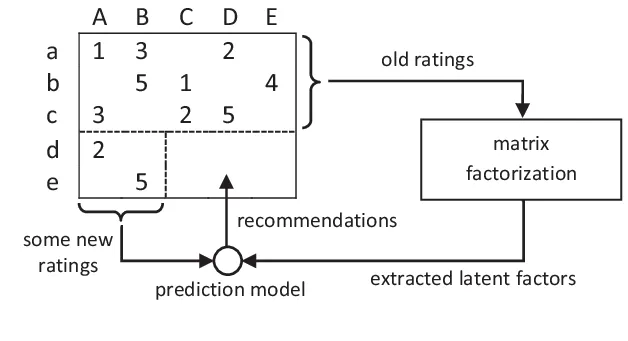
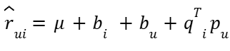
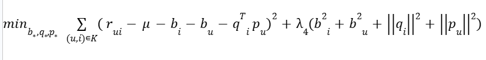
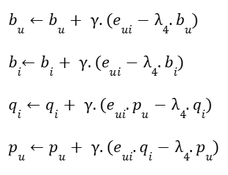
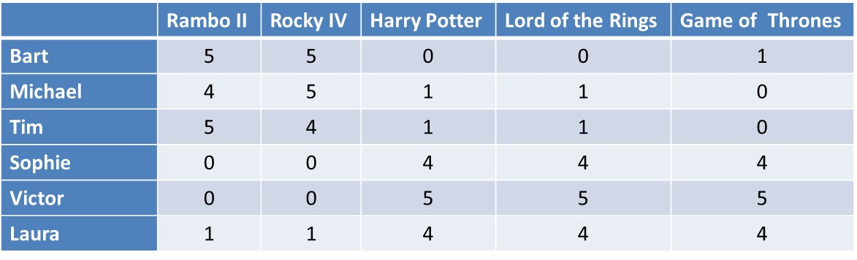
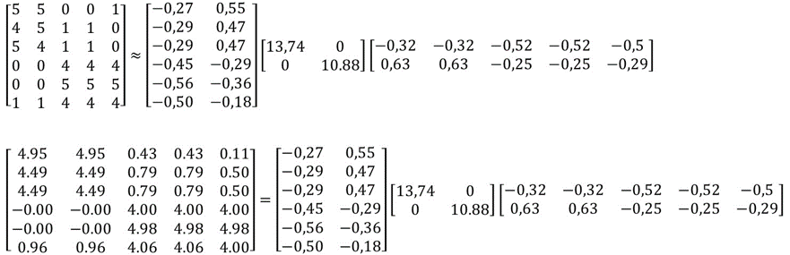
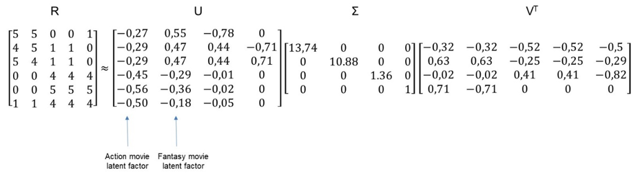

# I. Introduction about SVD:

 **SVD** is a mathematical technique that allows us to break down a matrix into its core components, called singular values and vectors. These values and vectors can then be used to make predictions about the original matrix. In the case of recommender systems, the matrix is usually a user-item matrix, where each row represents a user, each column represents an item, and the cells contain ratings or interactions between users and items.

   
  
# II. Idea:
 The goal of using SVD to factorize a user-item matrix is to find two new matrices, one representing users and the other representing items, that when multiplied together, approximate the original matrix as closely as possible. These new matrices are called latent representations, and they contain important information about the users and items that can be used to make recommendations.

 The process of performing SVD on a user-item matrix can be broken down into three steps:
  - Decompose the user-item matrix into three matrices: U, S, and V.
  - Keep only the top k singular values and their corresponding vectors, this is useful in order to reduce the complexity and computational costs without losing too much information.
  - Multiply the matrices back together to obtain an approximation of the original user-item matrix.

**Note:** 
 - The first matrix, \\mu, represents the users, where each row represents a user and each column represents a latent feature or dimension of the user.
 - The latent features or dimensions are determined by the singular values in matrix S. 
 - The second matrix, V, represents the items, where each row represents an item and each column represents a latent feature or dimension of the item.

# III. Formulas:
## 3.1. The SVD Model:
SVD is developed on Baseline model.  
SVD introduces two new scalar variables: the user biases bu and the item biases bi.The user biases are supposed to capture the tendency of some users to rate items higher (or lower) than the average.The model is SVD is then as follows:

   
   
 Where:
 - Each item i associated with qi &#8712; Rf,each item u associated with qu &#8712; Rf
 - For item i, qi measure the extent to which the item possess those factors,positive or negative
 - For a given user u, the elements of pu measure the extent of interest the user has in items that are high on the corresponding factors
 - &mu; is the global average of all the ratings in the dataset.
 In order to learn the model parameters (bu,bi, pu and qi) we minimize the regularized squared error:
 
   
   
 Where the constant λ4, which controls the extent of regularization, is usually determined by cross validation.

## 3.2. Stochastic Gradient Descent:
 Stochastic Gradient Descent (SGD) is a very common algorithm for optimization where the parameters (here the biases and the factor vectors) are iteratively incremented with the negative gradients w.r.t the optimization function. The algorithm essentially performs the following steps for a given number of iterations:
 
   
   
 Where &gamma; is the learning rate, landa is the  regularization, $e_{ui} =  r_{ui} - \hat r_{u,i} = r_{u,i} - (&mu; + b_u + b_i + q_{i}^{T}p_{u})$ is the error made by the model for the pair (u,i)

# IV. Example:

   
   
 Let’s work out an example to illustrate how SVD works.  Suppose we have a rating matrix, as shown above, with 6 users: Bart, Michael, Tim, Sophie, Victor and Laura.  We have 5 movies Rambo II, Rocky IV, Harry Potter, Lord of the Rings and Game of Thrones.  Since it’s a small rating matrix, we can make some quick observations.  Bart, Michael and Tim especially like action movies, such as Rambo II and Rocky IV, and are not fond of fantasy movies such as Harry Potter, Lord of the Rings and Game of Thrones.  Sophie, Victor and Laura don’t like action movies, but they do like fantasy movies.  You can see that the Harry Potter and Lord of the Rings columns contain identical values, so the rank of this matrix is 4.

   

 Above you can see the result of the SVD decomposition.  Let’s look at the diagonal Σ matrix in the middle first.  You can see it’s a 4 by 4 square matrix and not a 5 by 5 square matrix.  The reason is because the rank of the rating matrix R was 4, so one of the singular values turned out to be 0 and was dropped.  You can see it has two big singular values 13,74 and 10,88 and two smaller ones 1.36 and 1.  This indicates that there are two latent factors in the rating matrix.  Let’s look at the first two columns of the U matrix.  In the first column, you can see a distinction between the first three values and the last three.  Essentially, this models the action movie latent factor liked by Bart, Michael and Tim.  Let’s look at the second column of the U matrix now.  Again, you see a discrepancy between the first 3 values and the final 3 values.  This essentially models the fantasy movie latent factor concept, as liked by Sophie, Victor and Laura.  Essentially, the matrix U can be interpreted as a user to latent factor similarity matrix.  The singular value 13.74 represents the strength of the action movie latent factor concept, whereas the singular value 10.88 indicates the strength of the fantasy movie latent factor concept. Finally, the V matrix can be interpreted as the movie to latent factor similarity matrix.  Let’s look at its first two rows.  In the first row, you can see a distinction between the first two values and the final three values.  This corresponds to the action movie latent factor concept.  Let’s now look at the second row.  You can see a discrepancy between the first two values and the final three values.  This corresponds to the fantasy movie latent factor concept.  We are now ready to do dimensionality reduction.  We will put the two smallest singular values 1.36 and 1 to zero, or reduce the Σ matrix to a 2 by 2 matrix. Obviously, this will remove the corresponding columns from the U and V matrices.

  

 Above you can see the result of this.  We now have a two by two Σ matrix with only the 2 biggest singular values corresponding to the 2 latent factors we identified earlier.  Let’s now also figure out how good this approximation is.  At the bottom, we calculated the exact dot product of the U, Σ and VT matrices.  You can see that the result approximates our original rating matrix pretty good.  The difference between both the original matrix and the approximation can be quantified using the root mean squared error, RMSE, or Frobenius norm of the differences.
 An obvious question when doing SVD is to pick the right amount of singular values or r.  This can be done using the concept of energy, which is defined as the sum of the squares of the singular values.  Let’s reconsider our earlier Σ matrix.

$$
\begin{bmatrix}
  13.74 & 0 & 0 & 0 \\
  0 & 10.88 & 0 & 0 \\
  0 & 0 & 1.360 & 0 \\
  0 & 0 & 0 & 1
\end{bmatrix}
$$

 The energy is calculated as 13.74²+10.88²+1.36²+1² which gives 310.  A common rule of thumb then states that we choose r such that the retained singular values keep at least 90% of the energy. In other words, if we drop 1.36 and 1, the resulting energy is 307 such that we managed to keep 99% of the energy.
