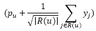
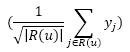

### I. Introduction
SVD++ is an improvement of the standard SVD algorithm, which enhances accuracy in recommendation systems by combining both implicit feedback and explicit feedback from users. This model, introduced by Yehuda Koren, has demonstrated superior effectiveness in scenarios where users have more implicit interactions than explicit ratings. Thanks to its ability to integrate various types of user interactions, SVD++ has become one of the leading models in recommendation systems, widely applied on platforms like Netflix, Amazon, and many other services.

### II. Idea
The idea of SVD++ is to not only rely on explicit ratings but also to utilize implicit interactions from users to better model their preferences. Implicit feedback provides an additional signal regarding user interests, especially when users have interacted with many items but haven’t given explicit ratings. For example, a user watching a movie without rating it can still be a useful indicator of their interest.

To achieve this, SVD++ adds a set of feature vectors for items to represent the influence of items that the user has interacted with. This approach allows the model to capture user preferences based on the list of items they’ve interacted with, even in the absence of direct ratings. The combination of information from ratings and implicit interactions enables the SVD++ model to better understand user preferences.

### III. Formulation
The prediction of SVD++ for a user-item pair ***(u, i)*** is based on the formula:

Where:
- ***μ*** is the global average of all ratings.
- ***bu*** and ***bi*** are the user and item biases, respectively, adjusting for individual tendencies.
- ***qi*** and ***pu*** are the feature vectors of item ***i*** and user ***u***, representing latent factors.
- ***R(u)*** is the set of items that user ***u*** has rated.
- ***yj*** is an auxiliary feature vector for items in ***R(u)***, designed to capture factors from implicit feedback.

In SVD++, each user ***u*** is modeled as . The term  helps model the user based on items they have interacted with, regardless of the ratings given. This ensures stability for the auxiliary vectors ***yj*** as the size of ***R(u)*** changes.

To optimize the model parameters, SVD++ uses gradient descent with a loss function adjusted by regularization terms to prevent overfitting. During optimization, the values of ***bu***, ***bi***, ***pu***, ***qi***, and ***yj*** are updated in each iteration.

### IV. Evaluation
The SVD++ model is highly regarded for its superior accuracy compared to traditional SVD, especially in systems with abundant implicit feedback. By incorporating unrated interactions, SVD++ significantly improves predictive accuracy for users with more implicit feedback than explicit ratings. When implemented on the Netflix dataset, SVD++ demonstrated outstanding performance in prediction.

Additionally, SVD++ can integrate various types of implicit feedback. For example, if a user has both viewing history and search history, SVD++ can use both types of information to enhance prediction accuracy by adding separate feature vectors for each interaction type.

One drawback of SVD++ is its higher computational requirements due to the additional processing of implicit feedback vectors, increasing both memory usage and processing time. However, the accuracy benefits that SVD++ provides often offset its computational cost, making it an ideal choice for modern recommendation systems where implicit feedback data is abundant and valuable.
