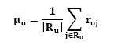
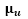
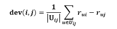
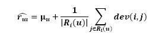
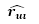

slope one algorithm here
Recommendation algorithms are generally categorized into three main groups: **Content-based Filtering**, **Collaborative Filtering**, and **Hybrid Recommendation Algorithms**. Among these, **Collaborative Filtering** is considered the most important and is often divided into two types: **User-based Collaborative Filtering** and **Item-based Collaborative Filtering**.  
**Collaborative Filtering (CF)** aims to predict a user's preferences or behaviors based on information from other users. The algorithm works on the assumption that if two users tend to like the same items in the past, there is a high probability that they will have similar preferences in the future.  
For example, suppose we want to predict whether a user will like Celine Dion's new album based on the fact that he gave a 5/5 rating to a Beatles album.  
In **Item-based CF**, the algorithm predicts the rating of a product based on ratings for similar products. One of the common techniques used is **linear regression** (f(x) = ax + b). However, if there are 1,000 products, up to 1,000,000 linear regression functions need to be learned, requiring 2,000,000 regression coefficients. This is a significant weakness of this method, as building too many models can lead to the issue of **overfitting**.  
To address this drawback, in 2005, Daniel Lemire and Anna Maclachlan proposed a simpler algorithm called **Slope One**. This algorithm is based on the difference between user ratings for pairs of products. Specifically, if a user prefers product A over product B, the difference between the two ratings can be used to predict his preference for a new product. This means that the difference between the ratings of two products can be used to estimate the rating for a product that the user has not rated yet.  
The **Slope One** algorithm is the simplest form of **Item-based CF**. Its simplicity makes it easier and more efficient to implement, while its accuracy is often comparable to more complex and computationally intensive algorithms.  
# I.	Ideas
**If user A rates product X higher than product Y with a certain difference, it can be inferred that user B, if they have not rated both products, will also likely rate product X higher than product Y by a similar margin. In other words, Slope One assumes that the difference in ratings between two products from one user will repeat for other users.**

### Detailed Explanation:

1. **Assumption of fixed differences between products:**
   - This algorithm is based on a simple assumption: if many users rate product X higher than product Y by a fixed difference (e.g., X is 2 points higher than Y), then other users will also tend to rate product X higher than Y by a similar margin. This means that Slope One doesn’t need to deeply understand the personal preferences of each user, but rather focuses on the relationship between products through the average difference in users' ratings.

2. **Average difference:**
   - Slope One calculates the average difference between pairs of products based on the ratings of users who have rated both products. Each pair of products X and Y has an average difference value that represents the disparity in the ratings of users between these two products. Based on this value, Slope One uses a user's rating for a known product (e.g., product X) to predict their rating for an unknown product (e.g., product Y).

   Slope One uses a simple formula: **x + b**, where:
   - **x** is the user's rating for the known product.
   - **b** is the average difference between the two products.

There are several reasons why the algorithm doesn’t use a more complex form like **ax + b**:

1. **Simplifying the model:**
   - The goal of Slope One is to keep the model simple and easy to implement. Using the formula **x + b** allows for quick and understandable predictions, while still achieving good results. Here, **b** represents the pre-calculated average difference between the two products.
   - Adding an additional coefficient **a** (a scaling factor) would complicate the model and require further parameter optimization, which goes against the original goal of simplicity and computational efficiency.

2. **Ease of visualization:**
   - The formula **x + b** represents a linear shift between products, based on the pre-calculated relationship. This is more intuitive, as it assumes the difference between two products is fixed and similar across users.
   - If we introduce the coefficient **a**, it would imply that the difference between products could vary depending on the specific rating of the user, which contradicts the main assumption of Slope One—that the difference between two products is consistent.

3. **No need for rating scaling:**
   - The coefficient **a** in the formula **ax + b** is often used to scale ratings (to change the magnitude of the predicted value). However, in Slope One, we only need to adjust the rating with a fixed shift based on the average difference. This doesn’t require scaling, so the **a** coefficient is unnecessary.

4. **Computational efficiency and scalability:**
   - Slope One is designed to compute quickly and scale easily for large systems. Using the formula **x + b** helps minimize the required computations, as it only needs to store and use the average difference values. If we were to use **ax + b**, we would need an additional step to estimate the **a** coefficient for each product pair, which would significantly increase the complexity and resource requirements.

### Example:

Assume there are four products (X, Y, Z, T) and five users: Alice, Bob, Charlie, Anna, and Peter, with the following rating table:

| User   | X  | Y  | Z  | T  |
|--------|----|----|----|----|
| User 1 | 5  | 3  | 4  | 3  |
| User 2 | 4  | 2  | ?  | 2  |
| User 3 | 4  | ?  | 3  | 3  |
| User 4 | 2  | 4  | 3  | ?  |
| User 5 | ?  | 4  | 2  | 4  |

The average ratings for these 5 users are:
- **User 1:** 3.75
- **User 2:** 2.67
- **User 3:** 3.33
- **User 4:** 3
- **User 5:** 3.33

#### Differences between products:
- **Difference between X and Y:**
   - User 1: 5 - 3 = 2
   - User 2: 4 - 2 = 2
   - User 4: 2 - 4 = -2
   - The average difference between X and Y is 0.67.

- **Difference between X and Z:**
   - User 1: 5 - 4 = 1
   - User 3: 4 - 3 = 1
   - User 4: 2 - 3 = -1
   - The average difference between X and Z is 0.33.

- **Difference between X and T:**
   - User 1: 5 - 3 = 2
   - User 2: 4 - 2 = 2
   - User 3: 4 - 3 = 1
   - The average difference between X and T is 1.67.

- **Difference between Y and Z:**
   - User 1: 3 - 4 = -1
   - User 4: 4 - 3 = 1
   - User 5: 4 - 2 = 2
   - The average difference between Y and Z is 0.67.

- **Difference between Y and T:**
   - User 1: 3 - 3 = 0
   - User 2: 2 - 2 = 0
   - User 5: 4 - 4 = 0
   - The average difference between Y and T is 0.

- **Difference between Z and T:**
   - User 1: 4 - 3 = 1
   - User 3: 3 - 3 = 0
   - User 5: 2 - 4 = -2
   - The average difference between Z and T is -0.33.

Since User 2 has rated X, Y, and T, using Slope One, we can predict User 2’s rating for Z by adding the average differences between Z and each of X, Y, and T to User 2's average rating. The predicted rating for User 2 on Z is approximately 2.23.
Similarly, we can predict the ratings for User 3 on Y, User 4 on T, and User 5 on X.
# II.	Formulation 
Modeling the rating points of two users *U* and *V* as vectors.  
- **U** = *(U<sub>1</sub>, U<sub>2</sub>, ..., U<sub>n</sub>)*: is the rating vector of user *U* for products *1* to *n*.  
- **V** = *(V<sub>1</sub>, V<sub>2</sub>, ..., V<sub>n</sub>)*: is the rating vector of user *V* for products *1* to *n*.  
The goal is to predict the rating of user *V* for product *n+1* based on the rating of user *U* for product *n+1*, i.e., *U<sub>n+1</sub>*.  
Slope One uses the simple formula **x + b**, where:  
- **x** is the rating of the user for the known product.  
- **b** is the average difference between the two products.  
Here, we approximate **x** as the average rating of the user for all the products they have rated.  
We need to find **b** such that vector *U* plus **b** is as close as possible to vector *V*.  
***S(b) = (U<sub>1</sub> + b - V<sub>1</sub>)<sup>2</sup> + (U<sub>2</sub> + b - V<sub>2</sub>)<sup>2</sup> + ... + (U<sub>n</sub> + b - V<sub>n</sub>)<sup>2</sup>***  
***S(b) = Σ<sub>i=1</sub><sup>n</sup> ((U<sub>i</sub> + b - V<sub>i</sub>)<sup>2</sup>***  
The optimal **b** occurs when *S'(b) = 0*.  
⇒ ***Σ<sub>i=1</sub><sup>n</sup> U<sub>i</sub> + b - V<sub>i</sub> = 0***  
⇒    
## 1. User Average Rating
  
Where:  
• : Represents the average rating given by user *u*.  
•***R<sub>u</sub>***: Is the set of items that user *u* has rated.  
•***R<sub>u</sub>***: The number of items rated by user *u*.  
•***r<sub>uj</sub>***: The rating given by user *u* for item *j*.  
**Reason for Calculating the Average Rating:** The average rating of a user indicates their general tendency when evaluating products. Users can be picky (often giving low ratings) or lenient (often giving high ratings). Calculating the average helps adjust predictions to align with each user's evaluation style.  
**For example:**  
If a user typically gives low ratings (such as an average of only 2 or 3 out of 5), then when predicting ratings for products that have not yet been rated, we need to adjust the predictions downward to fit this style.  
Conversely, if a user typically gives high ratings, the predictions should also be adjusted upward.  
## 2. Deviation Formula 
  
Where:  
•***dev(i,j)***: Represents the average deviation between the ratings of item *i* and item *j*.  
•***|U<sub>ij</sub>|***: The number of users who have rated both items *i* and *j*.  
•***U<sub>ij</sub>***: The set of users who have rated both items *i* and *j*.  
•***r<sub>ui</sub>***: The rating given by user *u* for item *i*.  
•***r<sub>uj</sub>***: The rating given by user *u* for item *j*.  
**Explanation:**  
The meaning of ***dev(i,j)***: This represents the average deviation between two products *i* and *j*, based on users who have rated both products. It indicates whether, on average, users rate product *i* higher or lower than product *j*, and by how much.  
**Reason for calculating the deviation:** The goal of Slope One is to utilize the relationships between products to predict user ratings. If it is known that users generally rate product *i* higher than product *j* by a specific amount, this information can be used to make predictions for users who have not rated both products.  
**For example:**  
Assume many users have rated both products X and Y, and on average, they rate X one point higher than Y. This suggests that if a user has rated Y as 3, they are likely to rate X as 4 (3 + 1 = 4). This allows predictions for products that have not been rated, based on information from other products.  
## 3. Prediction Formula
  
Where:  
• : Is the predicted rating that user *u* would give for item *i*.  
• : Is the average rating that user *u* has given, which reflects the general tendency of this user to rate items (e.g., some users tend to give higher ratings than others).  
•***R<sub>i</sub>(u)***: Is the set of related items, i.e., the set of items *j* that user *u* has rated and that have at least one user in common with item *i*.  
•|***R<sub>i</sub>(u)***|: Is the number of related items in ***R<sub>i</sub>(u)***.  
•***dev(i,j)***: Is the average deviation between the ratings of item *i* and item *j*.  
**Reason for this formula:** The predicted rating is calculated by:  
1. Starting from the average rating of user  to adjust for their overall tendency.  
2. Adding the average of the deviations between product *i* and other products that the user has rated. This allows the prediction to be adjusted based on information from similar products that the user has rated.    
# III. Algorithm
**Step 1: Initialize Data**  
	Collect data: Gather data from users and products to create a rating matrix. Each row in the matrix represents a user, and each column represents a product. The value in the matrix is the rating that the user has given to the product (or it could be a None/NaN value if the user has not rated the product).  
**Step 2: Calculate User Averages**  
	For each user *u*:   
	   
	Where ***R<sub>u</sub>*** is the set of items that user *u* has rated.  

**Step 3: Calculate Item Deviations**  
	Create a deviation matrix ***dev(i,j)*** for all pairs of items i and j:  
	For each pair of items i and j:  
  Find all users u who have rated both items i and j.  
  Calculate the deviation:  
	 

**Step 4: Predict the rating**  
	To predict the rating for user u on item i:  
  Calculate:  
	 
## Pseudocode
```Pseudocode
function slopeOnePredict(userId, itemId, ratings):
    // Step 1: Initialize data
    userAvgRating = {} // Dictionary to store average rating of each user  
    itemDeviation = {} // Dictionary to store deviations between items  
  
    // Step 2: Calculate user averages  
    for user in ratings:  
        userRatings = ratings[user] // Get ratings for the user  
        userAvgRating[user] = calculateAverage(userRatings)  
  
    // Step 3: Calculate item deviations  
    for itemA in ratings.items():  
        for itemB in ratings.items():  
            if itemA != itemB:  
                commonUsers = findCommonUsers(itemA, itemB, ratings)  
                if commonUsers:  
                    deviation = calculateDeviation(itemA, itemB, commonUsers, ratings)  
                    itemDeviation[(itemA, itemB)] = deviation  
  
    // Step 4: Predict the rating  
    relevantItems = findRelevantItems(userId, ratings)  
    predictedRating = userAvgRating[userId]  
      
    if relevantItems:  
        for item in relevantItems:  
            predictedRating += (1 / len(relevantItems)) * itemDeviation[(itemId, item)]  
      
    return predictedRating  

function calculateAverage(userRatings):  
    total = 0  
    count = 0  
    for rating in userRatings:  
        total += rating  
        count += 1  
    return total / count if count > 0 else 0  
  
function calculateDeviation(itemA, itemB, commonUsers, ratings):  
    totalDeviation = 0  
    for user in commonUsers:  
        totalDeviation += (ratings[user][itemA] - ratings[user][itemB])  
    return totalDeviation / len(commonUsers)  
  
function findCommonUsers(itemA, itemB, ratings):  
    commonUsers = []  
    for user in ratings:  
        if itemA in ratings[user] and itemB in ratings[user]:  
            commonUsers.append(user)  
    return commonUsers  
  
function findRelevantItems(userId, ratings):  
    // Return the list of items rated by the user  
    return ratings[userId].keys()
```

## IV.	Evaluation
**Advantages:**  
**Simple and Easy to Understand:** Slope One has a simple mathematical structure, making it easy to understand and implement. Calculating the average and deviation between items is not too complicated.  
**Efficient:** Slope One often produces accurate and efficient predictions, especially when there are many users who have rated similar items.  
**Scalability:** The algorithm scales well as the number of items and users increases. It remains effective even when there are many items and ratings.  
**Reduced Overfitting:** Compared to some other methods (such as complex linear regression), Slope One has a lower tendency to overfit due to its simplicity.  
**Low Memory Requirements:** Slope One requires less memory to store the necessary information for making predictions compared to some more complex algorithms.  

**Disadvantages:**  
**Dependent on Rating Data:** The algorithm may perform poorly if there is insufficient rating data or if the rating data is incomplete. If users only rate a small number of items, the prediction accuracy decreases.  
**Limited to Pairwise Product Relationships:** Slope One primarily relies on pairs of items to calculate deviations, which can limit its ability to predict when there are not many related items among users.  
**Does Not Handle Sparse Data Well:** When data is very sparse (many items but few user ratings), Slope One can struggle to find relationships between items and users.  
**Limited User Relationship Consideration:** Slope One focuses more on relationships between items rather than between users. If user relationships are more important, the algorithm may not perform well.  
**Limited Recommendation Capability:** Because predictions depend on similarities between existing items, Slope One may not be able to recommend new or unpopular items that have no user ratings.  
