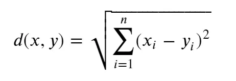
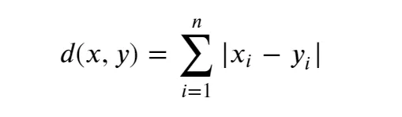
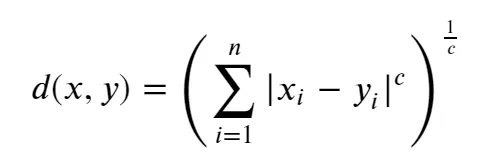
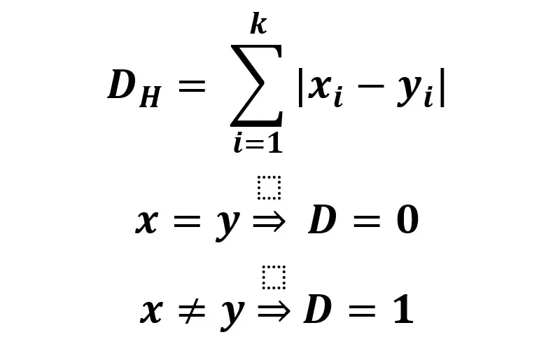

knn-based algorithm here

# I.	Ideas
k-nearest neighbor is one of the simplest (and effective in some cases) supervised-learning algorithms in Machine Learning. When training, this algorithm does not learn anything from the training data (this is also the reason this algorithm is classified as lazy learning), all calculations are performed when it needs to predict the results of new data. K-nearest neighbor can be applied to both types of Supervised learning problems: Classification and Regression. As a classification algorithm, kNN assigns a new data point to the majority set within its neighbors. As a regression algorithm, kNN makes a prediction based on the average of the values closest to the query point. KNN is also known as an Instance-based or Memory-based learning algorithm. kNN is a supervised learning algorithm in which 'k' represents the number of nearest neighbors considered in the classification or regression problem, and 'NN' stands for the nearest neighbors to the number chosen for k.

For example, fruit, vegetable and grain can be distinguished by their crunchiness and sweetness (Figure 1). For the purpose of displaying them on a two-dimension plot, only two characteristics are employed. In reality, there can be any number of predictors, and the example can be extended to incorporate any number of characteristics. In general, fruits are sweeter than vegetables. Grains are neither crunchy nor sweet. Our work is to determine which category does the sweet potato belong to. In this example we choose four nearest kinds of food, they are apple, green bean, lettuce, and corn.

Figure 1

There are two important concepts in the above example. One is the method to calculate the distance between sweet potato and other kinds of food. There are different methods used to calculate distance:

Euclidean distance is the most common distance measure, which measures a straight line between the query point and the other point being measured.

Manhattan distance is also a popular distance measure, which measures the absolute value between two points. It is represented on a grid, and often referred to as taxicab geometry — how do you travel from point A (your query point) to point B (the point being measured)?

Minkowski distance is a generalization of Euclidean and Manhattan distance metrics, which enables the creation of other distance metrics. It is calculated in a normed vector space. In the Minkowski distance, p is the parameter that defines the type of distance used in the calculation. If p=1, then the Manhattan distance is used. If p=2, then the Euclidean distance is used.

Hamming distance, also referred to as the overlap metric, is a technique used with Boolean or string vectors to identify where vectors do not match. In other words, it measures the distance between two strings of equal length. It is especially useful for error detection and error correction codes.

Another concept is the parameter k which decides how many neighbors will be chosen for kNN algorithm. The appropriate choice of k has significant impact on the diagnostic performance of kNN algorithm. A large k reduces the impact of variance caused by random error, but runs the risk of ignoring small but important pattern. The key to choose an appropriate k value is to strike a balance between overfitting and underfitting. 
# II.	Formulation

## 1. Euclidean distance

## 2. Manhattan distance 

## 3. Minkowski distance

## 3. Hamming distance

# III. Algorithm
**Step 1: Selecting the optimal value of K**
K represents the number of nearest neighbors that needs to be considered while making prediction.

**Step 2: Calculating distance**
To measure the similarity between target and training data points, Euclidean distance is used. Distance is calculated between each of the data points in the dataset and target point.

**Step 3: Finding Nearest Neighbors**
The k data points with the smallest distances to the target point are the nearest neighbors.

**Step 4: Voting for Classification or Taking Average for Regression**
In the classification problem, the class labels of K-nearest neighbors are determined by performing majority voting. The class with the most occurrences among the neighbors becomes the predicted class for the target data point.
In the regression problem, the class label is calculated by taking average of the target values of K nearest neighbors. The calculated average value becomes the predicted output for the target data point.

## Pseudocode
DistanceToNN=sort(distance from 1st example, distance from kth example)

value i=1 to number of training records:

Dist=distance(test example, ith example)

if (Dist<any example in DistanceToNN):

Remove the example from DistanceToNN and value.

Put new example in DistanceToNN and value in sorted order.

Return average of value.

## IV.	Evaluation
**Advantages:** 

**Easy to implement** as the complexity of the algorithm is not that high.

**Adapts Easily** – As per the working of the KNN algorithm it stores all the data in memory storage and hence whenever a new example or data point is added then the algorithm adjusts itself as per that new example and has its contribution to the future predictions as well.

**Few Hyperparameters** – The only parameters which are required in the training of a KNN algorithm are the value of k and the choice of the distance metric which we would like to choose from our evaluation metric.

**Disadvantages:**   

**Does not scale** – As we have heard about this that the KNN algorithm is also considered a Lazy Algorithm. The main significance of this term is that this takes lots of computing power as well as data storage. This makes this algorithm both time-consuming and resource exhausting.

**Curse of Dimensionality** – There is a term known as the peaking phenomenon according to this the KNN algorithm is affected by the curse of dimensionality which implies the algorithm faces a hard time classifying the data points properly when the dimensionality is too high.

**Prone to Overfitting** – As the algorithm is affected due to the curse of dimensionality it is prone to the problem of overfitting as well. Hence generally feature selection as well as dimensionality reduction techniques are applied to deal with this problem.

## V. REFERENCES

https://www.ncbi.nlm.nih.gov/pmc/articles/PMC4916348/

https://www.geeksforgeeks.org/k-nearest-neighbours/

https://medium.com/@rizwanayasmeen06/k-nearest-neighbor-knn-algorithm-in-machine-learning-d38d9638d7e0