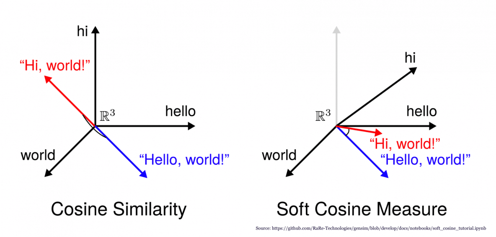
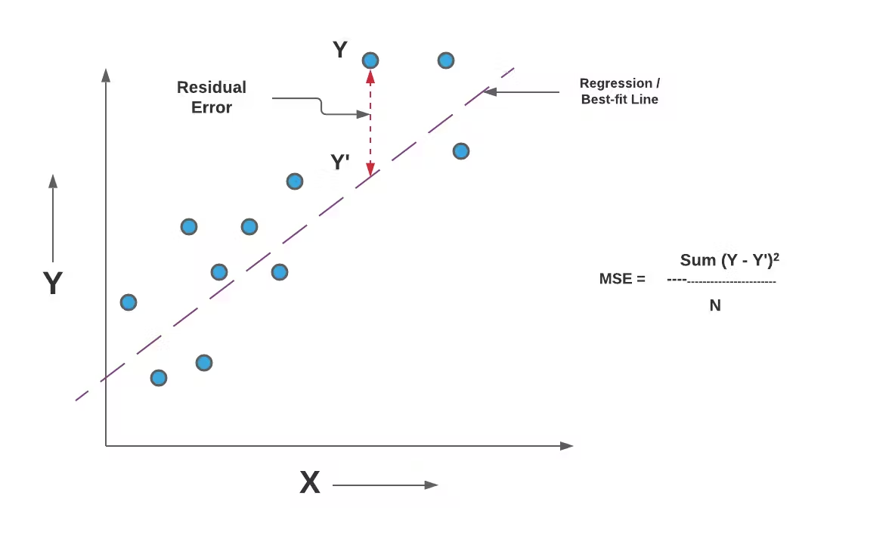
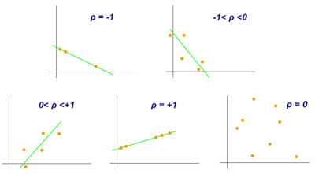

# I.	Introduction

k-nearest neighbor is one of the simplest (and effective in some cases) supervised-learning algorithms in Machine Learning. When training, this algorithm does not learn anything from the training data (this is also the reason this algorithm is classified as lazy learning), all calculations are performed when it needs to predict the results of new data. K-nearest neighbor can be applied to both types of Supervised learning problems: Classification and Regression. As a classification algorithm, kNN assigns a new data point to the majority set within its neighbors. As a regression algorithm, kNN makes a prediction based on the average of the values closest to the query point. KNN is also known as an Instance-based or Memory-based learning algorithm. kNN is a supervised learning algorithm in which 'k' represents the number of nearest neighbors considered in the classification or regression problem, and 'NN' stands for the nearest neighbors to the number chosen for k.

For example, fruit, vegetable and grain can be distinguished by their crunchiness and sweetness (Figure 1). For the purpose of displaying them on a two-dimension plot, only two characteristics are employed. In reality, there can be any number of predictors, and the example can be extended to incorporate any number of characteristics. In general, fruits are sweeter than vegetables. Grains are neither crunchy nor sweet. Our work is to determine which category does the sweet potato belong to. In this example we choose four nearest kinds of food, they are apple, green bean, lettuce, and corn.

  

  <b>Image 1:</b> An exmaple of k-nearest neighbor algogirthms.

There are two important concepts in the above example. One is the method to calculate the distance between sweet potato and other kinds of food. Another concept is the parameter k which decides how many neighbors will be chosen for kNN algorithm. The appropriate choice of k has significant impact on the diagnostic performance of kNN algorithm. A large k reduces the impact of variance caused by random error, but runs the risk of ignoring small but important pattern. The key to choose an appropriate k value is to strike a balance between overfitting and underfitting.

# II.   Notation Standard

In the documentation, you will find the following notation:

<ul class="simple">
<li>
<mjx-container class="MathJax CtxtMenu_Attached_0" jax="CHTML" tabindex="0" ctxtmenu_counter="0" style="font-size: 117.4%; position: relative;"><mjx-math class="MJX-TEX" aria-hidden="true"><mjx-mi class="mjx-i"><mjx-c class="mjx-c1D445 TEX-I"></mjx-c></mjx-mi></mjx-math><mjx-assistive-mml unselectable="on" display="inline"><math xmlns="http://www.w3.org/1998/Math/MathML"><mi>R</mi></math></mjx-assistive-mml></mjx-container> : the set of all ratings.
</li>
<li>
<mjx-container class="MathJax CtxtMenu_Attached_0" jax="CHTML" tabindex="0" ctxtmenu_counter="1" style="font-size: 117.4%; position: relative;"><mjx-math class="MJX-TEX" aria-hidden="true"><mjx-msub><mjx-mi class="mjx-i"><mjx-c class="mjx-c1D445 TEX-I"></mjx-c></mjx-mi><mjx-script style="vertical-align: -0.15em;"><mjx-texatom size="s" texclass="ORD"><mjx-mi class="mjx-i"><mjx-c class="mjx-c1D461 TEX-I"></mjx-c></mjx-mi><mjx-mi class="mjx-i"><mjx-c class="mjx-c1D45F TEX-I"></mjx-c></mjx-mi><mjx-mi class="mjx-i"><mjx-c class="mjx-c1D44E TEX-I"></mjx-c></mjx-mi><mjx-mi class="mjx-i"><mjx-c class="mjx-c1D456 TEX-I"></mjx-c></mjx-mi><mjx-mi class="mjx-i"><mjx-c class="mjx-c1D45B TEX-I"></mjx-c></mjx-mi></mjx-texatom></mjx-script></mjx-msub></mjx-math><mjx-assistive-mml unselectable="on" display="inline"><math xmlns="http://www.w3.org/1998/Math/MathML"><msub><mi>R</mi><mrow data-mjx-texclass="ORD"><mi>t</mi><mi>r</mi><mi>a</mi><mi>i</mi><mi>n</mi></mrow></msub></math></mjx-assistive-mml></mjx-container>, <mjx-container class="MathJax CtxtMenu_Attached_0" jax="CHTML" tabindex="0" ctxtmenu_counter="2" style="font-size: 117.4%; position: relative;"><mjx-math class="MJX-TEX" aria-hidden="true"><mjx-msub><mjx-mi class="mjx-i"><mjx-c class="mjx-c1D445 TEX-I"></mjx-c></mjx-mi><mjx-script style="vertical-align: -0.15em;"><mjx-texatom size="s" texclass="ORD"><mjx-mi class="mjx-i"><mjx-c class="mjx-c1D461 TEX-I"></mjx-c></mjx-mi><mjx-mi class="mjx-i"><mjx-c class="mjx-c1D452 TEX-I"></mjx-c></mjx-mi><mjx-mi class="mjx-i"><mjx-c class="mjx-c1D460 TEX-I"></mjx-c></mjx-mi><mjx-mi class="mjx-i"><mjx-c class="mjx-c1D461 TEX-I"></mjx-c></mjx-mi></mjx-texatom></mjx-script></mjx-msub></mjx-math><mjx-assistive-mml unselectable="on" display="inline"><math xmlns="http://www.w3.org/1998/Math/MathML"><msub><mi>R</mi><mrow data-mjx-texclass="ORD"><mi>t</mi><mi>e</mi><mi>s</mi><mi>t</mi></mrow></msub></math></mjx-assistive-mml></mjx-container> and <mjx-container class="MathJax CtxtMenu_Attached_0" jax="CHTML" tabindex="0" ctxtmenu_counter="3" style="font-size: 117.4%; position: relative;"><mjx-math class="MJX-TEX" aria-hidden="true"><mjx-texatom texclass="ORD"><mjx-mover><mjx-over style="padding-bottom: 0.105em; padding-left: 0.463em; margin-bottom: -0.531em;"><mjx-mo class="mjx-n" style="width: 0px; margin-left: -0.25em;"><mjx-c class="mjx-c5E"></mjx-c></mjx-mo></mjx-over><mjx-base><mjx-mi class="mjx-i"><mjx-c class="mjx-c1D445 TEX-I"></mjx-c></mjx-mi></mjx-base></mjx-mover></mjx-texatom></mjx-math><mjx-assistive-mml unselectable="on" display="inline"><math xmlns="http://www.w3.org/1998/Math/MathML"><mrow data-mjx-texclass="ORD"><mover><mi>R</mi><mo stretchy="false">^</mo></mover></mrow></math></mjx-assistive-mml></mjx-container> denote the training set, the test set, and the set of predicted ratings.
</li>
<li>
<mjx-container class="MathJax CtxtMenu_Attached_0" jax="CHTML" tabindex="0" ctxtmenu_counter="4" style="font-size: 117.4%; position: relative;"><mjx-math class="MJX-TEX" aria-hidden="true"><mjx-mi class="mjx-i"><mjx-c class="mjx-c1D448 TEX-I"></mjx-c></mjx-mi></mjx-math><mjx-assistive-mml unselectable="on" display="inline"><math xmlns="http://www.w3.org/1998/Math/MathML"><mi>U</mi></math></mjx-assistive-mml></mjx-container> : the set of all users. <mjx-container class="MathJax CtxtMenu_Attached_0" jax="CHTML" tabindex="0" ctxtmenu_counter="5" style="font-size: 117.4%; position: relative;"><mjx-math class="MJX-TEX" aria-hidden="true"><mjx-mi class="mjx-i"><mjx-c class="mjx-c1D462 TEX-I"></mjx-c></mjx-mi></mjx-math><mjx-assistive-mml unselectable="on" display="inline"><math xmlns="http://www.w3.org/1998/Math/MathML"><mi>u</mi></math></mjx-assistive-mml></mjx-container> and <mjx-container class="MathJax CtxtMenu_Attached_0" jax="CHTML" tabindex="0" ctxtmenu_counter="6" style="font-size: 117.4%; position: relative;"><mjx-math class="MJX-TEX" aria-hidden="true"><mjx-mi class="mjx-i"><mjx-c class="mjx-c1D463 TEX-I"></mjx-c></mjx-mi></mjx-math><mjx-assistive-mml unselectable="on" display="inline"><math xmlns="http://www.w3.org/1998/Math/MathML"><mi>v</mi></math></mjx-assistive-mml></mjx-container> denotes users.
</li>
<li>
<mjx-container class="MathJax CtxtMenu_Attached_0" jax="CHTML" tabindex="0" ctxtmenu_counter="7" style="font-size: 117.4%; position: relative;"><mjx-math class="MJX-TEX" aria-hidden="true"><mjx-mi class="mjx-i"><mjx-c class="mjx-c1D43C TEX-I"></mjx-c></mjx-mi></mjx-math><mjx-assistive-mml unselectable="on" display="inline"><math xmlns="http://www.w3.org/1998/Math/MathML"><mi>I</mi></math></mjx-assistive-mml></mjx-container> : the set of all items. <mjx-container class="MathJax CtxtMenu_Attached_0" jax="CHTML" tabindex="0" ctxtmenu_counter="8" style="font-size: 117.4%; position: relative;"><mjx-math class="MJX-TEX" aria-hidden="true"><mjx-mi class="mjx-i"><mjx-c class="mjx-c1D456 TEX-I"></mjx-c></mjx-mi></mjx-math><mjx-assistive-mml unselectable="on" display="inline"><math xmlns="http://www.w3.org/1998/Math/MathML"><mi>i</mi></math></mjx-assistive-mml></mjx-container> and <mjx-container class="MathJax CtxtMenu_Attached_0" jax="CHTML" tabindex="0" ctxtmenu_counter="9" style="font-size: 117.4%; position: relative;"><mjx-math class="MJX-TEX" aria-hidden="true"><mjx-mi class="mjx-i"><mjx-c class="mjx-c1D457 TEX-I"></mjx-c></mjx-mi></mjx-math><mjx-assistive-mml unselectable="on" display="inline"><math xmlns="http://www.w3.org/1998/Math/MathML"><mi>j</mi></math></mjx-assistive-mml></mjx-container> denotes items.
</li>
<li>
<mjx-container class="MathJax CtxtMenu_Attached_0" jax="CHTML" tabindex="0" ctxtmenu_counter="10" style="font-size: 117.4%; position: relative;"><mjx-math class="MJX-TEX" aria-hidden="true"><mjx-msub><mjx-mi class="mjx-i"><mjx-c class="mjx-c1D448 TEX-I"></mjx-c></mjx-mi><mjx-script style="vertical-align: -0.15em; margin-left: -0.084em;"><mjx-mi class="mjx-i" size="s"><mjx-c class="mjx-c1D456 TEX-I"></mjx-c></mjx-mi></mjx-script></mjx-msub></mjx-math><mjx-assistive-mml unselectable="on" display="inline"><math xmlns="http://www.w3.org/1998/Math/MathML"><msub><mi>U</mi><mi>i</mi></msub></math></mjx-assistive-mml></mjx-container> : the set of all users that have rated item <mjx-container class="MathJax CtxtMenu_Attached_0" jax="CHTML" tabindex="0" ctxtmenu_counter="11" style="font-size: 117.4%; position: relative;"><mjx-math class="MJX-TEX" aria-hidden="true"><mjx-mi class="mjx-i"><mjx-c class="mjx-c1D456 TEX-I"></mjx-c></mjx-mi></mjx-math><mjx-assistive-mml unselectable="on" display="inline"><math xmlns="http://www.w3.org/1998/Math/MathML"><mi>i</mi></math></mjx-assistive-mml></mjx-container>.
</li>
<li>
<mjx-container class="MathJax CtxtMenu_Attached_0" jax="CHTML" tabindex="0" ctxtmenu_counter="12" style="font-size: 117.4%; position: relative;"><mjx-math class="MJX-TEX" aria-hidden="true"><mjx-msub><mjx-mi class="mjx-i"><mjx-c class="mjx-c1D448 TEX-I"></mjx-c></mjx-mi><mjx-script style="vertical-align: -0.15em; margin-left: -0.084em;"><mjx-texatom size="s" texclass="ORD"><mjx-mi class="mjx-i"><mjx-c class="mjx-c1D456 TEX-I"></mjx-c></mjx-mi><mjx-mi class="mjx-i"><mjx-c class="mjx-c1D457 TEX-I"></mjx-c></mjx-mi></mjx-texatom></mjx-script></mjx-msub></mjx-math><mjx-assistive-mml unselectable="on" display="inline"><math xmlns="http://www.w3.org/1998/Math/MathML"><msub><mi>U</mi><mrow data-mjx-texclass="ORD"><mi>i</mi><mi>j</mi></mrow></msub></math></mjx-assistive-mml></mjx-container> : the set of all users that have rated both items <mjx-container class="MathJax CtxtMenu_Attached_0" jax="CHTML" tabindex="0" ctxtmenu_counter="13" style="font-size: 117.4%; position: relative;"><mjx-math class="MJX-TEX" aria-hidden="true"><mjx-mi class="mjx-i"><mjx-c class="mjx-c1D456 TEX-I"></mjx-c></mjx-mi></mjx-math><mjx-assistive-mml unselectable="on" display="inline"><math xmlns="http://www.w3.org/1998/Math/MathML"><mi>i</mi></math></mjx-assistive-mml></mjx-container>
and <mjx-container class="MathJax CtxtMenu_Attached_0" jax="CHTML" tabindex="0" ctxtmenu_counter="14" style="font-size: 117.4%; position: relative;"><mjx-math class="MJX-TEX" aria-hidden="true"><mjx-mi class="mjx-i"><mjx-c class="mjx-c1D457 TEX-I"></mjx-c></mjx-mi></mjx-math><mjx-assistive-mml unselectable="on" display="inline"><math xmlns="http://www.w3.org/1998/Math/MathML"><mi>j</mi></math></mjx-assistive-mml></mjx-container>.
</li>
<li>
<mjx-container class="MathJax CtxtMenu_Attached_0" jax="CHTML" tabindex="0" ctxtmenu_counter="15" style="font-size: 117.4%; position: relative;"><mjx-math class="MJX-TEX" aria-hidden="true"><mjx-msub><mjx-mi class="mjx-i"><mjx-c class="mjx-c1D43C TEX-I"></mjx-c></mjx-mi><mjx-script style="vertical-align: -0.15em; margin-left: -0.064em;"><mjx-mi class="mjx-i" size="s"><mjx-c class="mjx-c1D462 TEX-I"></mjx-c></mjx-mi></mjx-script></mjx-msub></mjx-math><mjx-assistive-mml unselectable="on" display="inline"><math xmlns="http://www.w3.org/1998/Math/MathML"><msub><mi>I</mi><mi>u</mi></msub></math></mjx-assistive-mml></mjx-container> : the set of all items rated by user <mjx-container class="MathJax CtxtMenu_Attached_0" jax="CHTML" tabindex="0" ctxtmenu_counter="16" style="font-size: 117.4%; position: relative;"><mjx-math class="MJX-TEX" aria-hidden="true"><mjx-mi class="mjx-i"><mjx-c class="mjx-c1D462 TEX-I"></mjx-c></mjx-mi></mjx-math><mjx-assistive-mml unselectable="on" display="inline"><math xmlns="http://www.w3.org/1998/Math/MathML"><mi>u</mi></math></mjx-assistive-mml></mjx-container>.
</li>
<li>
<mjx-container class="MathJax CtxtMenu_Attached_0" jax="CHTML" tabindex="0" ctxtmenu_counter="17" style="font-size: 117.4%; position: relative;"><mjx-math class="MJX-TEX" aria-hidden="true"><mjx-msub><mjx-mi class="mjx-i"><mjx-c class="mjx-c1D43C TEX-I"></mjx-c></mjx-mi><mjx-script style="vertical-align: -0.15em; margin-left: -0.064em;"><mjx-texatom size="s" texclass="ORD"><mjx-mi class="mjx-i"><mjx-c class="mjx-c1D462 TEX-I"></mjx-c></mjx-mi><mjx-mi class="mjx-i"><mjx-c class="mjx-c1D463 TEX-I"></mjx-c></mjx-mi></mjx-texatom></mjx-script></mjx-msub></mjx-math><mjx-assistive-mml unselectable="on" display="inline"><math xmlns="http://www.w3.org/1998/Math/MathML"><msub><mi>I</mi><mrow data-mjx-texclass="ORD"><mi>u</mi><mi>v</mi></mrow></msub></math></mjx-assistive-mml></mjx-container> : the set of all items rated by both users <mjx-container class="MathJax CtxtMenu_Attached_0" jax="CHTML" tabindex="0" ctxtmenu_counter="18" style="font-size: 117.4%; position: relative;"><mjx-math class="MJX-TEX" aria-hidden="true"><mjx-mi class="mjx-i"><mjx-c class="mjx-c1D462 TEX-I"></mjx-c></mjx-mi></mjx-math><mjx-assistive-mml unselectable="on" display="inline"><math xmlns="http://www.w3.org/1998/Math/MathML"><mi>u</mi></math></mjx-assistive-mml></mjx-container>
and <mjx-container class="MathJax CtxtMenu_Attached_0" jax="CHTML" tabindex="0" ctxtmenu_counter="19" style="font-size: 117.4%; position: relative;"><mjx-math class="MJX-TEX" aria-hidden="true"><mjx-mi class="mjx-i"><mjx-c class="mjx-c1D463 TEX-I"></mjx-c></mjx-mi></mjx-math><mjx-assistive-mml unselectable="on" display="inline"><math xmlns="http://www.w3.org/1998/Math/MathML"><mi>v</mi></math></mjx-assistive-mml></mjx-container>.
</li>
<li>
<mjx-container class="MathJax CtxtMenu_Attached_0" jax="CHTML" tabindex="0" ctxtmenu_counter="20" style="font-size: 117.4%; position: relative;"><mjx-math class="MJX-TEX" aria-hidden="true"><mjx-msub><mjx-mi class="mjx-i"><mjx-c class="mjx-c1D45F TEX-I"></mjx-c></mjx-mi><mjx-script style="vertical-align: -0.15em;"><mjx-texatom size="s" texclass="ORD"><mjx-mi class="mjx-i"><mjx-c class="mjx-c1D462 TEX-I"></mjx-c></mjx-mi><mjx-mi class="mjx-i"><mjx-c class="mjx-c1D456 TEX-I"></mjx-c></mjx-mi></mjx-texatom></mjx-script></mjx-msub></mjx-math><mjx-assistive-mml unselectable="on" display="inline"><math xmlns="http://www.w3.org/1998/Math/MathML"><msub><mi>r</mi><mrow data-mjx-texclass="ORD"><mi>u</mi><mi>i</mi></mrow></msub></math></mjx-assistive-mml></mjx-container> : the <em>true</em> rating of user <mjx-container class="MathJax CtxtMenu_Attached_0" jax="CHTML" tabindex="0" ctxtmenu_counter="21" style="font-size: 117.4%; position: relative;"><mjx-math class="MJX-TEX" aria-hidden="true"><mjx-mi class="mjx-i"><mjx-c class="mjx-c1D462 TEX-I"></mjx-c></mjx-mi></mjx-math><mjx-assistive-mml unselectable="on" display="inline"><math xmlns="http://www.w3.org/1998/Math/MathML"><mi>u</mi></math></mjx-assistive-mml></mjx-container> for item
<mjx-container class="MathJax CtxtMenu_Attached_0" jax="CHTML" tabindex="0" ctxtmenu_counter="22" style="font-size: 117.4%; position: relative;"><mjx-math class="MJX-TEX" aria-hidden="true"><mjx-mi class="mjx-i"><mjx-c class="mjx-c1D456 TEX-I"></mjx-c></mjx-mi></mjx-math><mjx-assistive-mml unselectable="on" display="inline"><math xmlns="http://www.w3.org/1998/Math/MathML"><mi>i</mi></math></mjx-assistive-mml></mjx-container>.
</li>
<li>
<mjx-container class="MathJax CtxtMenu_Attached_0" jax="CHTML" tabindex="0" ctxtmenu_counter="23" style="font-size: 117.4%; position: relative;"><mjx-math class="MJX-TEX" aria-hidden="true"><mjx-msub><mjx-texatom texclass="ORD"><mjx-mover><mjx-over style="padding-bottom: 0.105em; padding-left: 0.281em; margin-bottom: -0.531em;"><mjx-mo class="mjx-n" style="width: 0px; margin-left: -0.25em;"><mjx-c class="mjx-c5E"></mjx-c></mjx-mo></mjx-over><mjx-base><mjx-mi class="mjx-i"><mjx-c class="mjx-c1D45F TEX-I"></mjx-c></mjx-mi></mjx-base></mjx-mover></mjx-texatom><mjx-script style="vertical-align: -0.15em;"><mjx-texatom size="s" texclass="ORD"><mjx-mi class="mjx-i"><mjx-c class="mjx-c1D462 TEX-I"></mjx-c></mjx-mi><mjx-mi class="mjx-i"><mjx-c class="mjx-c1D456 TEX-I"></mjx-c></mjx-mi></mjx-texatom></mjx-script></mjx-msub></mjx-math><mjx-assistive-mml unselectable="on" display="inline"><math xmlns="http://www.w3.org/1998/Math/MathML"><msub><mrow data-mjx-texclass="ORD"><mover><mi>r</mi><mo stretchy="false">^</mo></mover></mrow><mrow data-mjx-texclass="ORD"><mi>u</mi><mi>i</mi></mrow></msub></math></mjx-assistive-mml></mjx-container> : the <em>estimated</em> rating of user <mjx-container class="MathJax CtxtMenu_Attached_0" jax="CHTML" tabindex="0" ctxtmenu_counter="24" style="font-size: 117.4%; position: relative;"><mjx-math class="MJX-TEX" aria-hidden="true"><mjx-mi class="mjx-i"><mjx-c class="mjx-c1D462 TEX-I"></mjx-c></mjx-mi></mjx-math><mjx-assistive-mml unselectable="on" display="inline"><math xmlns="http://www.w3.org/1998/Math/MathML"><mi>u</mi></math></mjx-assistive-mml></mjx-container> for item
<mjx-container class="MathJax CtxtMenu_Attached_0" jax="CHTML" tabindex="0" ctxtmenu_counter="25" style="font-size: 117.4%; position: relative;"><mjx-math class="MJX-TEX" aria-hidden="true"><mjx-mi class="mjx-i"><mjx-c class="mjx-c1D456 TEX-I"></mjx-c></mjx-mi></mjx-math><mjx-assistive-mml unselectable="on" display="inline"><math xmlns="http://www.w3.org/1998/Math/MathML"><mi>i</mi></math></mjx-assistive-mml></mjx-container>.
</li>
<li>
<mjx-container class="MathJax CtxtMenu_Attached_0" jax="CHTML" tabindex="0" ctxtmenu_counter="26" style="font-size: 117.4%; position: relative;"><mjx-math class="MJX-TEX" aria-hidden="true"><mjx-msub><mjx-mi class="mjx-i"><mjx-c class="mjx-c1D44F TEX-I"></mjx-c></mjx-mi><mjx-script style="vertical-align: -0.15em;"><mjx-texatom size="s" texclass="ORD"><mjx-mi class="mjx-i"><mjx-c class="mjx-c1D462 TEX-I"></mjx-c></mjx-mi><mjx-mi class="mjx-i"><mjx-c class="mjx-c1D456 TEX-I"></mjx-c></mjx-mi></mjx-texatom></mjx-script></mjx-msub></mjx-math><mjx-assistive-mml unselectable="on" display="inline"><math xmlns="http://www.w3.org/1998/Math/MathML"><msub><mi>b</mi><mrow data-mjx-texclass="ORD"><mi>u</mi><mi>i</mi></mrow></msub></math></mjx-assistive-mml></mjx-container> : the baseline rating of user <mjx-container class="MathJax CtxtMenu_Attached_0" jax="CHTML" tabindex="0" ctxtmenu_counter="27" style="font-size: 117.4%; position: relative;"><mjx-math class="MJX-TEX" aria-hidden="true"><mjx-mi class="mjx-i"><mjx-c class="mjx-c1D462 TEX-I"></mjx-c></mjx-mi></mjx-math><mjx-assistive-mml unselectable="on" display="inline"><math xmlns="http://www.w3.org/1998/Math/MathML"><mi>u</mi></math></mjx-assistive-mml></mjx-container> for item <mjx-container class="MathJax CtxtMenu_Attached_0" jax="CHTML" tabindex="0" ctxtmenu_counter="28" style="font-size: 117.4%; position: relative;"><mjx-math class="MJX-TEX" aria-hidden="true"><mjx-mi class="mjx-i"><mjx-c class="mjx-c1D456 TEX-I"></mjx-c></mjx-mi></mjx-math><mjx-assistive-mml unselectable="on" display="inline"><math xmlns="http://www.w3.org/1998/Math/MathML"><mi>i</mi></math></mjx-assistive-mml></mjx-container>.
</li>
<li>
<mjx-container class="MathJax CtxtMenu_Attached_0" jax="CHTML" tabindex="0" ctxtmenu_counter="29" style="font-size: 117.4%; position: relative;"><mjx-math class="MJX-TEX" aria-hidden="true"><mjx-mi class="mjx-i"><mjx-c class="mjx-c1D707 TEX-I"></mjx-c></mjx-mi></mjx-math><mjx-assistive-mml unselectable="on" display="inline"><math xmlns="http://www.w3.org/1998/Math/MathML"><mi>μ</mi></math></mjx-assistive-mml></mjx-container> : the mean of all ratings.
</li>
<li>
<mjx-container class="MathJax CtxtMenu_Attached_0" jax="CHTML" tabindex="0" ctxtmenu_counter="30" style="font-size: 117.4%; position: relative;"><mjx-math class="MJX-TEX" aria-hidden="true"><mjx-msub><mjx-mi class="mjx-i"><mjx-c class="mjx-c1D707 TEX-I"></mjx-c></mjx-mi><mjx-script style="vertical-align: -0.15em;"><mjx-mi class="mjx-i" size="s"><mjx-c class="mjx-c1D462 TEX-I"></mjx-c></mjx-mi></mjx-script></mjx-msub></mjx-math><mjx-assistive-mml unselectable="on" display="inline"><math xmlns="http://www.w3.org/1998/Math/MathML"><msub><mi>μ</mi><mi>u</mi></msub></math></mjx-assistive-mml></mjx-container> : the mean of all ratings given by user <mjx-container class="MathJax CtxtMenu_Attached_0" jax="CHTML" tabindex="0" ctxtmenu_counter="31" style="font-size: 117.4%; position: relative;"><mjx-math class="MJX-TEX" aria-hidden="true"><mjx-mi class="mjx-i"><mjx-c class="mjx-c1D462 TEX-I"></mjx-c></mjx-mi></mjx-math><mjx-assistive-mml unselectable="on" display="inline"><math xmlns="http://www.w3.org/1998/Math/MathML"><mi>u</mi></math></mjx-assistive-mml></mjx-container>.
</li>
<li>
<mjx-container class="MathJax CtxtMenu_Attached_0" jax="CHTML" tabindex="0" ctxtmenu_counter="32" style="font-size: 117.4%; position: relative;"><mjx-math class="MJX-TEX" aria-hidden="true"><mjx-msub><mjx-mi class="mjx-i"><mjx-c class="mjx-c1D707 TEX-I"></mjx-c></mjx-mi><mjx-script style="vertical-align: -0.15em;"><mjx-mi class="mjx-i" size="s"><mjx-c class="mjx-c1D456 TEX-I"></mjx-c></mjx-mi></mjx-script></mjx-msub></mjx-math><mjx-assistive-mml unselectable="on" display="inline"><math xmlns="http://www.w3.org/1998/Math/MathML"><msub><mi>μ</mi><mi>i</mi></msub></math></mjx-assistive-mml></mjx-container> : the mean of all ratings given to item <mjx-container class="MathJax CtxtMenu_Attached_0" jax="CHTML" tabindex="0" ctxtmenu_counter="33" style="font-size: 117.4%; position: relative;"><mjx-math class="MJX-TEX" aria-hidden="true"><mjx-mi class="mjx-i"><mjx-c class="mjx-c1D456 TEX-I"></mjx-c></mjx-mi></mjx-math><mjx-assistive-mml unselectable="on" display="inline"><math xmlns="http://www.w3.org/1998/Math/MathML"><mi>i</mi></math></mjx-assistive-mml></mjx-container>.
</li>
<li>
<mjx-container class="MathJax CtxtMenu_Attached_0" jax="CHTML" tabindex="0" ctxtmenu_counter="34" style="font-size: 117.4%; position: relative;"><mjx-math class="MJX-TEX" aria-hidden="true"><mjx-msub><mjx-mi class="mjx-i"><mjx-c class="mjx-c1D70E TEX-I"></mjx-c></mjx-mi><mjx-script style="vertical-align: -0.15em;"><mjx-mi class="mjx-i" size="s"><mjx-c class="mjx-c1D462 TEX-I"></mjx-c></mjx-mi></mjx-script></mjx-msub></mjx-math><mjx-assistive-mml unselectable="on" display="inline"><math xmlns="http://www.w3.org/1998/Math/MathML"><msub><mi>σ</mi><mi>u</mi></msub></math></mjx-assistive-mml></mjx-container> : the standard deviation of all ratings given by user <mjx-container class="MathJax CtxtMenu_Attached_0" jax="CHTML" tabindex="0" ctxtmenu_counter="35" style="font-size: 117.4%; position: relative;"><mjx-math class="MJX-TEX" aria-hidden="true"><mjx-mi class="mjx-i"><mjx-c class="mjx-c1D462 TEX-I"></mjx-c></mjx-mi></mjx-math><mjx-assistive-mml unselectable="on" display="inline"><math xmlns="http://www.w3.org/1998/Math/MathML"><mi>u</mi></math></mjx-assistive-mml></mjx-container>.
</li>
<li>
<mjx-container class="MathJax CtxtMenu_Attached_0" jax="CHTML" tabindex="0" ctxtmenu_counter="36" style="font-size: 117.4%; position: relative;"><mjx-math class="MJX-TEX" aria-hidden="true"><mjx-msub><mjx-mi class="mjx-i"><mjx-c class="mjx-c1D70E TEX-I"></mjx-c></mjx-mi><mjx-script style="vertical-align: -0.15em;"><mjx-mi class="mjx-i" size="s"><mjx-c class="mjx-c1D456 TEX-I"></mjx-c></mjx-mi></mjx-script></mjx-msub></mjx-math><mjx-assistive-mml unselectable="on" display="inline"><math xmlns="http://www.w3.org/1998/Math/MathML"><msub><mi>σ</mi><mi>i</mi></msub></math></mjx-assistive-mml></mjx-container> : the standard deviation of all ratings given to item <mjx-container class="MathJax CtxtMenu_Attached_0" jax="CHTML" tabindex="0" ctxtmenu_counter="37" style="font-size: 117.4%; position: relative;"><mjx-math class="MJX-TEX" aria-hidden="true"><mjx-mi class="mjx-i"><mjx-c class="mjx-c1D456 TEX-I"></mjx-c></mjx-mi></mjx-math><mjx-assistive-mml unselectable="on" display="inline"><math xmlns="http://www.w3.org/1998/Math/MathML"><mi>i</mi></math></mjx-assistive-mml></mjx-container>.
</li>
<li>
<mjx-container class="MathJax CtxtMenu_Attached_0" jax="CHTML" tabindex="0" ctxtmenu_counter="38" style="font-size: 117.4%; position: relative;"><mjx-math class="MJX-TEX" aria-hidden="true"><mjx-msubsup><mjx-mi class="mjx-i"><mjx-c class="mjx-c1D441 TEX-I"></mjx-c></mjx-mi><mjx-script style="vertical-align: -0.292em; margin-left: -0.085em;"><mjx-mi class="mjx-i" size="s" style="margin-left: 0.197em;"><mjx-c class="mjx-c1D458 TEX-I"></mjx-c></mjx-mi><mjx-spacer style="margin-top: 0.18em;"></mjx-spacer><mjx-mi class="mjx-i" size="s"><mjx-c class="mjx-c1D456 TEX-I"></mjx-c></mjx-mi></mjx-script></mjx-msubsup><mjx-mo class="mjx-n"><mjx-c class="mjx-c28"></mjx-c></mjx-mo><mjx-mi class="mjx-i"><mjx-c class="mjx-c1D462 TEX-I"></mjx-c></mjx-mi><mjx-mo class="mjx-n"><mjx-c class="mjx-c29"></mjx-c></mjx-mo></mjx-math><mjx-assistive-mml unselectable="on" display="inline"><math xmlns="http://www.w3.org/1998/Math/MathML"><msubsup><mi>N</mi><mi>i</mi><mi>k</mi></msubsup><mo stretchy="false">(</mo><mi>u</mi><mo stretchy="false">)</mo></math></mjx-assistive-mml></mjx-container> : the <mjx-container class="MathJax CtxtMenu_Attached_0" jax="CHTML" tabindex="0" ctxtmenu_counter="39" style="font-size: 117.4%; position: relative;"><mjx-math class="MJX-TEX" aria-hidden="true"><mjx-mi class="mjx-i"><mjx-c class="mjx-c1D458 TEX-I"></mjx-c></mjx-mi></mjx-math><mjx-assistive-mml unselectable="on" display="inline"><math xmlns="http://www.w3.org/1998/Math/MathML"><mi>k</mi></math></mjx-assistive-mml></mjx-container> nearest neighbors of user <mjx-container class="MathJax CtxtMenu_Attached_0" jax="CHTML" tabindex="0" ctxtmenu_counter="40" style="font-size: 117.4%; position: relative;"><mjx-math class="MJX-TEX" aria-hidden="true"><mjx-mi class="mjx-i"><mjx-c class="mjx-c1D462 TEX-I"></mjx-c></mjx-mi></mjx-math><mjx-assistive-mml unselectable="on" display="inline"><math xmlns="http://www.w3.org/1998/Math/MathML"><mi>u</mi></math></mjx-assistive-mml></mjx-container> that
have rated item <mjx-container class="MathJax CtxtMenu_Attached_0" jax="CHTML" tabindex="0" ctxtmenu_counter="41" style="font-size: 117.4%; position: relative;"><mjx-math class="MJX-TEX" aria-hidden="true"><mjx-mi class="mjx-i"><mjx-c class="mjx-c1D456 TEX-I"></mjx-c></mjx-mi></mjx-math><mjx-assistive-mml unselectable="on" display="inline"><math xmlns="http://www.w3.org/1998/Math/MathML"><mi>i</mi></math></mjx-assistive-mml></mjx-container>.
</li>
<li>
<mjx-container class="MathJax CtxtMenu_Attached_0" jax="CHTML" tabindex="0" ctxtmenu_counter="42" style="font-size: 117.4%; position: relative;"><mjx-math class="MJX-TEX" aria-hidden="true"><mjx-msubsup><mjx-mi class="mjx-i"><mjx-c class="mjx-c1D441 TEX-I"></mjx-c></mjx-mi><mjx-script style="vertical-align: -0.247em; margin-left: -0.085em;"><mjx-mi class="mjx-i" size="s" style="margin-left: 0.197em;"><mjx-c class="mjx-c1D458 TEX-I"></mjx-c></mjx-mi><mjx-spacer style="margin-top: 0.29em;"></mjx-spacer><mjx-mi class="mjx-i" size="s"><mjx-c class="mjx-c1D462 TEX-I"></mjx-c></mjx-mi></mjx-script></mjx-msubsup><mjx-mo class="mjx-n"><mjx-c class="mjx-c28"></mjx-c></mjx-mo><mjx-mi class="mjx-i"><mjx-c class="mjx-c1D456 TEX-I"></mjx-c></mjx-mi><mjx-mo class="mjx-n"><mjx-c class="mjx-c29"></mjx-c></mjx-mo></mjx-math><mjx-assistive-mml unselectable="on" display="inline"><math xmlns="http://www.w3.org/1998/Math/MathML"><msubsup><mi>N</mi><mi>u</mi><mi>k</mi></msubsup><mo stretchy="false">(</mo><mi>i</mi><mo stretchy="false">)</mo></math></mjx-assistive-mml></mjx-container> : the <mjx-container class="MathJax CtxtMenu_Attached_0" jax="CHTML" tabindex="0" ctxtmenu_counter="43" style="font-size: 117.4%; position: relative;"><mjx-math class="MJX-TEX" aria-hidden="true"><mjx-mi class="mjx-i"><mjx-c class="mjx-c1D458 TEX-I"></mjx-c></mjx-mi></mjx-math><mjx-assistive-mml unselectable="on" display="inline"><math xmlns="http://www.w3.org/1998/Math/MathML"><mi>k</mi></math></mjx-assistive-mml></mjx-container> nearest neighbors of item <mjx-container class="MathJax CtxtMenu_Attached_0" jax="CHTML" tabindex="0" ctxtmenu_counter="44" style="font-size: 117.4%; position: relative;"><mjx-math class="MJX-TEX" aria-hidden="true"><mjx-mi class="mjx-i"><mjx-c class="mjx-c1D456 TEX-I"></mjx-c></mjx-mi></mjx-math><mjx-assistive-mml unselectable="on" display="inline"><math xmlns="http://www.w3.org/1998/Math/MathML"><mi>i</mi></math></mjx-assistive-mml></mjx-container> that
are rated by user <mjx-container class="MathJax CtxtMenu_Attached_0" jax="CHTML" tabindex="0" ctxtmenu_counter="45" style="font-size: 117.4%; position: relative;"><mjx-math class="MJX-TEX" aria-hidden="true"><mjx-mi class="mjx-i"><mjx-c class="mjx-c1D462 TEX-I"></mjx-c></mjx-mi></mjx-math><mjx-assistive-mml unselectable="on" display="inline"><math xmlns="http://www.w3.org/1998/Math/MathML"><mi>u</mi></math></mjx-assistive-mml></mjx-container>.
</li>
</ul>

# III.  Calculate similarity

To calculate similarity in the nearest neighbors algorithm, we can choose from the following three options:

## 1. Cosine similarity

Cosine similarity is a mathematical metric used to measure the similarity between two vectors in a multi-dimensional space, particularly in high-dimensional spaces, by calculating the cosine of the angle between them. It follows that the cosine similarity does not depend on the magnitudes of the vectors, but only on their angle. The cosine similarity always belongs to the interval [−1, 1].

  

  <b>Image 2:</b> Examples of cosine similarity.

The cosine similarity is defined as:

<math xmlns="http://www.w3.org/1998/Math/MathML" display="block">
  <mtext>cosine_sim</mtext>
  <mo stretchy="false">(</mo>
  <mi>u</mi>
  <mo>,</mo>
  <mi>v</mi>
  <mo stretchy="false">)</mo>
  <mo>=</mo>
  <mfrac>
    <mrow>
      <munder>
        <mo data-mjx-texclass="OP" movablelimits="false">&#x2211;</mo>
        <mrow data-mjx-texclass="ORD">
          <mi>i</mi>
          <mo>&#x2208;</mo>
          <msub>
            <mi>I</mi>
            <mrow data-mjx-texclass="ORD">
              <mi>u</mi>
              <mi>v</mi>
            </mrow>
          </msub>
        </mrow>
      </munder>
      <msub>
        <mi>r</mi>
        <mrow data-mjx-texclass="ORD">
          <mi>u</mi>
          <mi>i</mi>
        </mrow>
      </msub>
      <mo>&#x22C5;</mo>
      <msub>
        <mi>r</mi>
        <mrow data-mjx-texclass="ORD">
          <mi>v</mi>
          <mi>i</mi>
        </mrow>
      </msub>
    </mrow>
    <mrow>
      <msqrt>
        <munder>
          <mo data-mjx-texclass="OP" movablelimits="false">&#x2211;</mo>
          <mrow data-mjx-texclass="ORD">
            <mi>i</mi>
            <mo>&#x2208;</mo>
            <msub>
              <mi>I</mi>
              <mrow data-mjx-texclass="ORD">
                <mi>u</mi>
                <mi>v</mi>
              </mrow>
            </msub>
          </mrow>
        </munder>
        <msubsup>
          <mi>r</mi>
          <mrow data-mjx-texclass="ORD">
            <mi>u</mi>
            <mi>i</mi>
          </mrow>
          <mn>2</mn>
        </msubsup>
      </msqrt>
      <mo>&#x22C5;</mo>
      <msqrt>
        <munder>
          <mo data-mjx-texclass="OP" movablelimits="false">&#x2211;</mo>
          <mrow data-mjx-texclass="ORD">
            <mi>i</mi>
            <mo>&#x2208;</mo>
            <msub>
              <mi>I</mi>
              <mrow data-mjx-texclass="ORD">
                <mi>u</mi>
                <mi>v</mi>
              </mrow>
            </msub>
          </mrow>
        </munder>
        <msubsup>
          <mi>r</mi>
          <mrow data-mjx-texclass="ORD">
            <mi>v</mi>
            <mi>i</mi>
          </mrow>
          <mn>2</mn>
        </msubsup>
      </msqrt>
    </mrow>
  </mfrac>
</math>

or

<math xmlns="http://www.w3.org/1998/Math/MathML" display="block">
  <mtext>cosine_sim</mtext>
  <mo stretchy="false">(</mo>
  <mi>i</mi>
  <mo>,</mo>
  <mi>j</mi>
  <mo stretchy="false">)</mo>
  <mo>=</mo>
  <mfrac>
    <mrow>
      <munder>
        <mo data-mjx-texclass="OP" movablelimits="false">&#x2211;</mo>
        <mrow data-mjx-texclass="ORD">
          <mi>u</mi>
          <mo>&#x2208;</mo>
          <msub>
            <mi>U</mi>
            <mrow data-mjx-texclass="ORD">
              <mi>i</mi>
              <mi>j</mi>
            </mrow>
          </msub>
        </mrow>
      </munder>
      <msub>
        <mi>r</mi>
        <mrow data-mjx-texclass="ORD">
          <mi>u</mi>
          <mi>i</mi>
        </mrow>
      </msub>
      <mo>&#x22C5;</mo>
      <msub>
        <mi>r</mi>
        <mrow data-mjx-texclass="ORD">
          <mi>u</mi>
          <mi>j</mi>
        </mrow>
      </msub>
    </mrow>
    <mrow>
      <msqrt>
        <munder>
          <mo data-mjx-texclass="OP" movablelimits="false">&#x2211;</mo>
          <mrow data-mjx-texclass="ORD">
            <mi>u</mi>
            <mo>&#x2208;</mo>
            <msub>
              <mi>U</mi>
              <mrow data-mjx-texclass="ORD">
                <mi>i</mi>
                <mi>j</mi>
              </mrow>
            </msub>
          </mrow>
        </munder>
        <msubsup>
          <mi>r</mi>
          <mrow data-mjx-texclass="ORD">
            <mi>u</mi>
            <mi>i</mi>
          </mrow>
          <mn>2</mn>
        </msubsup>
      </msqrt>
      <mo>&#x22C5;</mo>
      <msqrt>
        <munder>
          <mo data-mjx-texclass="OP" movablelimits="false">&#x2211;</mo>
          <mrow data-mjx-texclass="ORD">
            <mi>u</mi>
            <mo>&#x2208;</mo>
            <msub>
              <mi>U</mi>
              <mrow data-mjx-texclass="ORD">
                <mi>i</mi>
                <mi>j</mi>
              </mrow>
            </msub>
          </mrow>
        </munder>
        <msubsup>
          <mi>r</mi>
          <mrow data-mjx-texclass="ORD">
            <mi>u</mi>
            <mi>j</mi>
          </mrow>
          <mn>2</mn>
        </msubsup>
      </msqrt>
    </mrow>
  </mfrac>
</math>

## 2. Mean Squared Difference similarity

Mean Squared Difference (MSD) is a statistical method that measures the average of the squared differences between pairs of values. It is commonly used to assess how different two sets of data are from each other. The formula is similar to the Mean Squared Error (MSE), but instead of comparing each value in a set to its expected value, it compares the differences between two sets of values.

  

  <b>Image 3:</b> Examples of Mean Squared Error. A formula that is similar to Mean Squared Difference.

The Mean Squared Difference is defined as:

<math xmlns="http://www.w3.org/1998/Math/MathML" display="block">
  <mtext>msd</mtext>
  <mo stretchy="false">(</mo>
  <mi>u</mi>
  <mo>,</mo>
  <mi>v</mi>
  <mo stretchy="false">)</mo>
  <mo>=</mo>
  <mfrac>
    <mn>1</mn>
    <mrow>
      <mo stretchy="false">|</mo>
      <msub>
        <mi>I</mi>
        <mrow data-mjx-texclass="ORD">
          <mi>u</mi>
          <mi>v</mi>
        </mrow>
      </msub>
      <mo stretchy="false">|</mo>
    </mrow>
  </mfrac>
  <mo>&#x22C5;</mo>
  <munder>
    <mo data-mjx-texclass="OP" movablelimits="false">&#x2211;</mo>
    <mrow data-mjx-texclass="ORD">
      <mi>i</mi>
      <mo>&#x2208;</mo>
      <msub>
        <mi>I</mi>
        <mrow data-mjx-texclass="ORD">
          <mi>u</mi>
          <mi>v</mi>
        </mrow>
      </msub>
    </mrow>
  </munder>
  <mo stretchy="false">(</mo>
  <msub>
    <mi>r</mi>
    <mrow data-mjx-texclass="ORD">
      <mi>u</mi>
      <mi>i</mi>
    </mrow>
  </msub>
  <mo>&#x2212;</mo>
  <msub>
    <mi>r</mi>
    <mrow data-mjx-texclass="ORD">
      <mi>v</mi>
      <mi>i</mi>
    </mrow>
  </msub>
  <msup>
    <mo stretchy="false">)</mo>
    <mn>2</mn>
  </msup>
</math>

or

<math xmlns="http://www.w3.org/1998/Math/MathML" display="block">
  <mtext>msd</mtext>
  <mo stretchy="false">(</mo>
  <mi>i</mi>
  <mo>,</mo>
  <mi>j</mi>
  <mo stretchy="false">)</mo>
  <mo>=</mo>
  <mfrac>
    <mn>1</mn>
    <mrow>
      <mo stretchy="false">|</mo>
      <msub>
        <mi>U</mi>
        <mrow data-mjx-texclass="ORD">
          <mi>i</mi>
          <mi>j</mi>
        </mrow>
      </msub>
      <mo stretchy="false">|</mo>
    </mrow>
  </mfrac>
  <mo>&#x22C5;</mo>
  <munder>
    <mo data-mjx-texclass="OP" movablelimits="false">&#x2211;</mo>
    <mrow data-mjx-texclass="ORD">
      <mi>u</mi>
      <mo>&#x2208;</mo>
      <msub>
        <mi>U</mi>
        <mrow data-mjx-texclass="ORD">
          <mi>i</mi>
          <mi>j</mi>
        </mrow>
      </msub>
    </mrow>
  </munder>
  <mo stretchy="false">(</mo>
  <msub>
    <mi>r</mi>
    <mrow data-mjx-texclass="ORD">
      <mi>u</mi>
      <mi>i</mi>
    </mrow>
  </msub>
  <mo>&#x2212;</mo>
  <msub>
    <mi>r</mi>
    <mrow data-mjx-texclass="ORD">
      <mi>u</mi>
      <mi>j</mi>
    </mrow>
  </msub>
  <msup>
    <mo stretchy="false">)</mo>
    <mn>2</mn>
  </msup>
</math>

The MSD-similarity is then defined as:

<math xmlns="http://www.w3.org/1998/Math/MathML" display="block">
  <mtable displaystyle="true" columnalign="right left" columnspacing="0em" rowspacing="3pt">
    <mtr>
      <mtd>
        <mtext>msd_sim</mtext>
        <mo stretchy="false">(</mo>
        <mi>u</mi>
        <mo>,</mo>
        <mi>v</mi>
        <mo stretchy="false">)</mo>
      </mtd>
      <mtd>
        <mi></mi>
        <mo>=</mo>
        <mfrac>
          <mn>1</mn>
          <mrow>
            <mtext>msd</mtext>
            <mo stretchy="false">(</mo>
            <mi>u</mi>
            <mo>,</mo>
            <mi>v</mi>
            <mo stretchy="false">)</mo>
            <mo>+</mo>
            <mn>1</mn>
          </mrow>
        </mfrac>
      </mtd>
    </mtr>
    <mtr>
      <mtd>
        <mtext>msd_sim</mtext>
        <mo stretchy="false">(</mo>
        <mi>i</mi>
        <mo>,</mo>
        <mi>j</mi>
        <mo stretchy="false">)</mo>
      </mtd>
      <mtd>
        <mi></mi>
        <mo>=</mo>
        <mfrac>
          <mn>1</mn>
          <mrow>
            <mtext>msd</mtext>
            <mo stretchy="false">(</mo>
            <mi>i</mi>
            <mo>,</mo>
            <mi>j</mi>
            <mo stretchy="false">)</mo>
            <mo>+</mo>
            <mn>1</mn>
          </mrow>
        </mfrac>
      </mtd>
    </mtr>
  </mtable>
</math>

The +1 term is just here to avoid dividing by zero.

## 3. Pearson correlation coefficient

Pearson Correlation is a statistical method that measures the similarity or correlation between two data objects by comparing their attributes and calculating a score ranging from -1 to +1. A high score indicates high similarity, while a score near zero indicates no correlation. This method is parametric and relies on the mean parameter of the objects, making it more valid for normally distributed data.

  

  <b>Image 4:</b> Examples of scatter diagrams with different values of correlation coefficient (ρ).

Image: Examples of scatter diagrams with different values of correlation coefficient (ρ).
The Pearson correlation for two objects, with paired attributes, sums the product of their differences from their object means, and divides the sum by the product of the squared differences from the object means, and is defined as:

<math xmlns="http://www.w3.org/1998/Math/MathML" display="block">
  <mtext>pearson_sim</mtext>
  <mo stretchy="false">(</mo>
  <mi>u</mi>
  <mo>,</mo>
  <mi>v</mi>
  <mo stretchy="false">)</mo>
  <mo>=</mo>
  <mfrac>
    <mrow>
      <munder>
        <mo data-mjx-texclass="OP" movablelimits="false">&#x2211;</mo>
        <mrow data-mjx-texclass="ORD">
          <mi>i</mi>
          <mo>&#x2208;</mo>
          <msub>
            <mi>I</mi>
            <mrow data-mjx-texclass="ORD">
              <mi>u</mi>
              <mi>v</mi>
            </mrow>
          </msub>
        </mrow>
      </munder>
      <mo stretchy="false">(</mo>
      <msub>
        <mi>r</mi>
        <mrow data-mjx-texclass="ORD">
          <mi>u</mi>
          <mi>i</mi>
        </mrow>
      </msub>
      <mo>&#x2212;</mo>
      <msub>
        <mi>&#x3BC;</mi>
        <mi>u</mi>
      </msub>
      <mo stretchy="false">)</mo>
      <mo>&#x22C5;</mo>
      <mo stretchy="false">(</mo>
      <msub>
        <mi>r</mi>
        <mrow data-mjx-texclass="ORD">
          <mi>v</mi>
          <mi>i</mi>
        </mrow>
      </msub>
      <mo>&#x2212;</mo>
      <msub>
        <mi>&#x3BC;</mi>
        <mrow data-mjx-texclass="ORD">
          <mi>v</mi>
        </mrow>
      </msub>
      <mo stretchy="false">)</mo>
    </mrow>
    <mrow>
      <msqrt>
        <munder>
          <mo data-mjx-texclass="OP" movablelimits="false">&#x2211;</mo>
          <mrow data-mjx-texclass="ORD">
            <mi>i</mi>
            <mo>&#x2208;</mo>
            <msub>
              <mi>I</mi>
              <mrow data-mjx-texclass="ORD">
                <mi>u</mi>
                <mi>v</mi>
              </mrow>
            </msub>
          </mrow>
        </munder>
        <mo stretchy="false">(</mo>
        <msub>
          <mi>r</mi>
          <mrow data-mjx-texclass="ORD">
            <mi>u</mi>
            <mi>i</mi>
          </mrow>
        </msub>
        <mo>&#x2212;</mo>
        <msub>
          <mi>&#x3BC;</mi>
          <mi>u</mi>
        </msub>
        <msup>
          <mo stretchy="false">)</mo>
          <mn>2</mn>
        </msup>
      </msqrt>
      <mo>&#x22C5;</mo>
      <msqrt>
        <munder>
          <mo data-mjx-texclass="OP" movablelimits="false">&#x2211;</mo>
          <mrow data-mjx-texclass="ORD">
            <mi>i</mi>
            <mo>&#x2208;</mo>
            <msub>
              <mi>I</mi>
              <mrow data-mjx-texclass="ORD">
                <mi>u</mi>
                <mi>v</mi>
              </mrow>
            </msub>
          </mrow>
        </munder>
        <mo stretchy="false">(</mo>
        <msub>
          <mi>r</mi>
          <mrow data-mjx-texclass="ORD">
            <mi>v</mi>
            <mi>i</mi>
          </mrow>
        </msub>
        <mo>&#x2212;</mo>
        <msub>
          <mi>&#x3BC;</mi>
          <mrow data-mjx-texclass="ORD">
            <mi>v</mi>
          </mrow>
        </msub>
        <msup>
          <mo stretchy="false">)</mo>
          <mn>2</mn>
        </msup>
      </msqrt>
    </mrow>
  </mfrac>
</math>

or

<math xmlns="http://www.w3.org/1998/Math/MathML" display="block">
  <mtext>pearson_sim</mtext>
  <mo stretchy="false">(</mo>
  <mi>i</mi>
  <mo>,</mo>
  <mi>j</mi>
  <mo stretchy="false">)</mo>
  <mo>=</mo>
  <mfrac>
    <mrow>
      <munder>
        <mo data-mjx-texclass="OP" movablelimits="false">&#x2211;</mo>
        <mrow data-mjx-texclass="ORD">
          <mi>u</mi>
          <mo>&#x2208;</mo>
          <msub>
            <mi>U</mi>
            <mrow data-mjx-texclass="ORD">
              <mi>i</mi>
              <mi>j</mi>
            </mrow>
          </msub>
        </mrow>
      </munder>
      <mo stretchy="false">(</mo>
      <msub>
        <mi>r</mi>
        <mrow data-mjx-texclass="ORD">
          <mi>u</mi>
          <mi>i</mi>
        </mrow>
      </msub>
      <mo>&#x2212;</mo>
      <msub>
        <mi>&#x3BC;</mi>
        <mi>i</mi>
      </msub>
      <mo stretchy="false">)</mo>
      <mo>&#x22C5;</mo>
      <mo stretchy="false">(</mo>
      <msub>
        <mi>r</mi>
        <mrow data-mjx-texclass="ORD">
          <mi>u</mi>
          <mi>j</mi>
        </mrow>
      </msub>
      <mo>&#x2212;</mo>
      <msub>
        <mi>&#x3BC;</mi>
        <mrow data-mjx-texclass="ORD">
          <mi>j</mi>
        </mrow>
      </msub>
      <mo stretchy="false">)</mo>
    </mrow>
    <mrow>
      <msqrt>
        <munder>
          <mo data-mjx-texclass="OP" movablelimits="false">&#x2211;</mo>
          <mrow data-mjx-texclass="ORD">
            <mi>u</mi>
            <mo>&#x2208;</mo>
            <msub>
              <mi>U</mi>
              <mrow data-mjx-texclass="ORD">
                <mi>i</mi>
                <mi>j</mi>
              </mrow>
            </msub>
          </mrow>
        </munder>
        <mo stretchy="false">(</mo>
        <msub>
          <mi>r</mi>
          <mrow data-mjx-texclass="ORD">
            <mi>u</mi>
            <mi>i</mi>
          </mrow>
        </msub>
        <mo>&#x2212;</mo>
        <msub>
          <mi>&#x3BC;</mi>
          <mi>i</mi>
        </msub>
        <msup>
          <mo stretchy="false">)</mo>
          <mn>2</mn>
        </msup>
      </msqrt>
      <mo>&#x22C5;</mo>
      <msqrt>
        <munder>
          <mo data-mjx-texclass="OP" movablelimits="false">&#x2211;</mo>
          <mrow data-mjx-texclass="ORD">
            <mi>u</mi>
            <mo>&#x2208;</mo>
            <msub>
              <mi>U</mi>
              <mrow data-mjx-texclass="ORD">
                <mi>i</mi>
                <mi>j</mi>
              </mrow>
            </msub>
          </mrow>
        </munder>
        <mo stretchy="false">(</mo>
        <msub>
          <mi>r</mi>
          <mrow data-mjx-texclass="ORD">
            <mi>u</mi>
            <mi>j</mi>
          </mrow>
        </msub>
        <mo>&#x2212;</mo>
        <msub>
          <mi>&#x3BC;</mi>
          <mrow data-mjx-texclass="ORD">
            <mi>j</mi>
          </mrow>
        </msub>
        <msup>
          <mo stretchy="false">)</mo>
          <mn>2</mn>
        </msup>
      </msqrt>
    </mrow>
  </mfrac>
</math>

Note: if there are no common users or items, similarity will be 0 (and not -1).

# IV.   k-NN inspired Algorithm

These are algorithms that are directly derived from a basic nearest neighbors approach. The notations sim(u,v) for users and sim(i,j) for items result from one of the three similarity calculation options mentioned above.

## 1. Basic k-NN Algorithm

A basic collaborative filtering algorithm.

The prediction <math xmlns="http://www.w3.org/1998/Math/MathML">
  <msub>
    <mrow data-mjx-texclass="ORD">
      <mover>
        <mi>r</mi>
        <mo stretchy="false">^</mo>
      </mover>
    </mrow>
    <mrow data-mjx-texclass="ORD">
      <mi>u</mi>
      <mi>i</mi>
    </mrow>
  </msub>
</math> is set as:

<math xmlns="http://www.w3.org/1998/Math/MathML" display="block">
  <msub>
    <mrow data-mjx-texclass="ORD">
      <mover>
        <mi>r</mi>
        <mo stretchy="false">^</mo>
      </mover>
    </mrow>
    <mrow data-mjx-texclass="ORD">
      <mi>u</mi>
      <mi>i</mi>
    </mrow>
  </msub>
  <mo>=</mo>
  <mfrac>
    <mrow>
      <munder>
        <mo data-mjx-texclass="OP" movablelimits="false">&#x2211;</mo>
        <mrow data-mjx-texclass="ORD">
          <mi>v</mi>
          <mo>&#x2208;</mo>
          <msubsup>
            <mi>N</mi>
            <mi>i</mi>
            <mi>k</mi>
          </msubsup>
          <mo stretchy="false">(</mo>
          <mi>u</mi>
          <mo stretchy="false">)</mo>
        </mrow>
      </munder>
      <mtext>sim</mtext>
      <mo stretchy="false">(</mo>
      <mi>u</mi>
      <mo>,</mo>
      <mi>v</mi>
      <mo stretchy="false">)</mo>
      <mo>&#x22C5;</mo>
      <msub>
        <mi>r</mi>
        <mrow data-mjx-texclass="ORD">
          <mi>v</mi>
          <mi>i</mi>
        </mrow>
      </msub>
    </mrow>
    <mrow>
      <munder>
        <mo data-mjx-texclass="OP" movablelimits="false">&#x2211;</mo>
        <mrow data-mjx-texclass="ORD">
          <mi>v</mi>
          <mo>&#x2208;</mo>
          <msubsup>
            <mi>N</mi>
            <mi>i</mi>
            <mi>k</mi>
          </msubsup>
          <mo stretchy="false">(</mo>
          <mi>u</mi>
          <mo stretchy="false">)</mo>
        </mrow>
      </munder>
      <mtext>sim</mtext>
      <mo stretchy="false">(</mo>
      <mi>u</mi>
      <mo>,</mo>
      <mi>v</mi>
      <mo stretchy="false">)</mo>
    </mrow>
  </mfrac>
</math>

or

<math xmlns="http://www.w3.org/1998/Math/MathML" display="block">
  <msub>
    <mrow data-mjx-texclass="ORD">
      <mover>
        <mi>r</mi>
        <mo stretchy="false">^</mo>
      </mover>
    </mrow>
    <mrow data-mjx-texclass="ORD">
      <mi>u</mi>
      <mi>i</mi>
    </mrow>
  </msub>
  <mo>=</mo>
  <mfrac>
    <mrow>
      <munder>
        <mo data-mjx-texclass="OP" movablelimits="false">&#x2211;</mo>
        <mrow data-mjx-texclass="ORD">
          <mi>j</mi>
          <mo>&#x2208;</mo>
          <msubsup>
            <mi>N</mi>
            <mi>u</mi>
            <mi>k</mi>
          </msubsup>
          <mo stretchy="false">(</mo>
          <mi>i</mi>
          <mo stretchy="false">)</mo>
        </mrow>
      </munder>
      <mtext>sim</mtext>
      <mo stretchy="false">(</mo>
      <mi>i</mi>
      <mo>,</mo>
      <mi>j</mi>
      <mo stretchy="false">)</mo>
      <mo>&#x22C5;</mo>
      <msub>
        <mi>r</mi>
        <mrow data-mjx-texclass="ORD">
          <mi>u</mi>
          <mi>j</mi>
        </mrow>
      </msub>
    </mrow>
    <mrow>
      <munder>
        <mo data-mjx-texclass="OP" movablelimits="false">&#x2211;</mo>
        <mrow data-mjx-texclass="ORD">
          <mi>j</mi>
          <mo>&#x2208;</mo>
          <msubsup>
            <mi>N</mi>
            <mi>u</mi>
            <mi>k</mi>
          </msubsup>
          <mo stretchy="false">(</mo>
          <mi>i</mi>
          <mo stretchy="false">)</mo>
        </mrow>
      </munder>
      <mtext>sim</mtext>
      <mo stretchy="false">(</mo>
      <mi>i</mi>
      <mo>,</mo>
      <mi>j</mi>
      <mo stretchy="false">)</mo>
    </mrow>
  </mfrac>
</math>

## 2. k-NN Algorithm with mean

A basic collaborative filtering algorithm, taking into account the mean ratings of each user.

The prediction <math xmlns="http://www.w3.org/1998/Math/MathML">
  <msub>
    <mrow data-mjx-texclass="ORD">
      <mover>
        <mi>r</mi>
        <mo stretchy="false">^</mo>
      </mover>
    </mrow>
    <mrow data-mjx-texclass="ORD">
      <mi>u</mi>
      <mi>i</mi>
    </mrow>
  </msub>
</math> is set as:

<math xmlns="http://www.w3.org/1998/Math/MathML" display="block">
  <msub>
    <mrow data-mjx-texclass="ORD">
      <mover>
        <mi>r</mi>
        <mo stretchy="false">^</mo>
      </mover>
    </mrow>
    <mrow data-mjx-texclass="ORD">
      <mi>u</mi>
      <mi>i</mi>
    </mrow>
  </msub>
  <mo>=</mo>
  <msub>
    <mi>&#x3BC;</mi>
    <mi>u</mi>
  </msub>
  <mo>+</mo>
  <mfrac>
    <mrow>
      <munder>
        <mo data-mjx-texclass="OP" movablelimits="false">&#x2211;</mo>
        <mrow data-mjx-texclass="ORD">
          <mi>v</mi>
          <mo>&#x2208;</mo>
          <msubsup>
            <mi>N</mi>
            <mi>i</mi>
            <mi>k</mi>
          </msubsup>
          <mo stretchy="false">(</mo>
          <mi>u</mi>
          <mo stretchy="false">)</mo>
        </mrow>
      </munder>
      <mtext>sim</mtext>
      <mo stretchy="false">(</mo>
      <mi>u</mi>
      <mo>,</mo>
      <mi>v</mi>
      <mo stretchy="false">)</mo>
      <mo>&#x22C5;</mo>
      <mo stretchy="false">(</mo>
      <msub>
        <mi>r</mi>
        <mrow data-mjx-texclass="ORD">
          <mi>v</mi>
          <mi>i</mi>
        </mrow>
      </msub>
      <mo>&#x2212;</mo>
      <msub>
        <mi>&#x3BC;</mi>
        <mi>v</mi>
      </msub>
      <mo stretchy="false">)</mo>
    </mrow>
    <mrow>
      <munder>
        <mo data-mjx-texclass="OP" movablelimits="false">&#x2211;</mo>
        <mrow data-mjx-texclass="ORD">
          <mi>v</mi>
          <mo>&#x2208;</mo>
          <msubsup>
            <mi>N</mi>
            <mi>i</mi>
            <mi>k</mi>
          </msubsup>
          <mo stretchy="false">(</mo>
          <mi>u</mi>
          <mo stretchy="false">)</mo>
        </mrow>
      </munder>
      <mtext>sim</mtext>
      <mo stretchy="false">(</mo>
      <mi>u</mi>
      <mo>,</mo>
      <mi>v</mi>
      <mo stretchy="false">)</mo>
    </mrow>
  </mfrac>
</math>

or

<math xmlns="http://www.w3.org/1998/Math/MathML" display="block">
  <msub>
    <mrow data-mjx-texclass="ORD">
      <mover>
        <mi>r</mi>
        <mo stretchy="false">^</mo>
      </mover>
    </mrow>
    <mrow data-mjx-texclass="ORD">
      <mi>u</mi>
      <mi>i</mi>
    </mrow>
  </msub>
  <mo>=</mo>
  <msub>
    <mi>&#x3BC;</mi>
    <mi>i</mi>
  </msub>
  <mo>+</mo>
  <mfrac>
    <mrow>
      <munder>
        <mo data-mjx-texclass="OP" movablelimits="false">&#x2211;</mo>
        <mrow data-mjx-texclass="ORD">
          <mi>j</mi>
          <mo>&#x2208;</mo>
          <msubsup>
            <mi>N</mi>
            <mi>u</mi>
            <mi>k</mi>
          </msubsup>
          <mo stretchy="false">(</mo>
          <mi>i</mi>
          <mo stretchy="false">)</mo>
        </mrow>
      </munder>
      <mtext>sim</mtext>
      <mo stretchy="false">(</mo>
      <mi>i</mi>
      <mo>,</mo>
      <mi>j</mi>
      <mo stretchy="false">)</mo>
      <mo>&#x22C5;</mo>
      <mo stretchy="false">(</mo>
      <msub>
        <mi>r</mi>
        <mrow data-mjx-texclass="ORD">
          <mi>u</mi>
          <mi>j</mi>
        </mrow>
      </msub>
      <mo>&#x2212;</mo>
      <msub>
        <mi>&#x3BC;</mi>
        <mi>j</mi>
      </msub>
      <mo stretchy="false">)</mo>
    </mrow>
    <mrow>
      <munder>
        <mo data-mjx-texclass="OP" movablelimits="false">&#x2211;</mo>
        <mrow data-mjx-texclass="ORD">
          <mi>j</mi>
          <mo>&#x2208;</mo>
          <msubsup>
            <mi>N</mi>
            <mi>u</mi>
            <mi>k</mi>
          </msubsup>
          <mo stretchy="false">(</mo>
          <mi>i</mi>
          <mo stretchy="false">)</mo>
        </mrow>
      </munder>
      <mtext>sim</mtext>
      <mo stretchy="false">(</mo>
      <mi>i</mi>
      <mo>,</mo>
      <mi>j</mi>
      <mo stretchy="false">)</mo>
    </mrow>
  </mfrac>
</math>

## 3. k-NN Algorithm with z-score

A basic collaborative filtering algorithm, taking into account the z-score normalization of each user.

The prediction <math xmlns="http://www.w3.org/1998/Math/MathML">
  <msub>
    <mrow data-mjx-texclass="ORD">
      <mover>
        <mi>r</mi>
        <mo stretchy="false">^</mo>
      </mover>
    </mrow>
    <mrow data-mjx-texclass="ORD">
      <mi>u</mi>
      <mi>i</mi>
    </mrow>
  </msub>
</math> is set as:

<math xmlns="http://www.w3.org/1998/Math/MathML" display="block">
  <msub>
    <mrow data-mjx-texclass="ORD">
      <mover>
        <mi>r</mi>
        <mo stretchy="false">^</mo>
      </mover>
    </mrow>
    <mrow data-mjx-texclass="ORD">
      <mi>u</mi>
      <mi>i</mi>
    </mrow>
  </msub>
  <mo>=</mo>
  <msub>
    <mi>&#x3BC;</mi>
    <mi>u</mi>
  </msub>
  <mo>+</mo>
  <msub>
    <mi>&#x3C3;</mi>
    <mi>u</mi>
  </msub>
  <mfrac>
    <mrow>
      <munder>
        <mo data-mjx-texclass="OP" movablelimits="false">&#x2211;</mo>
        <mrow data-mjx-texclass="ORD">
          <mi>v</mi>
          <mo>&#x2208;</mo>
          <msubsup>
            <mi>N</mi>
            <mi>i</mi>
            <mi>k</mi>
          </msubsup>
          <mo stretchy="false">(</mo>
          <mi>u</mi>
          <mo stretchy="false">)</mo>
        </mrow>
      </munder>
      <mtext>sim</mtext>
      <mo stretchy="false">(</mo>
      <mi>u</mi>
      <mo>,</mo>
      <mi>v</mi>
      <mo stretchy="false">)</mo>
      <mo>&#x22C5;</mo>
      <mo stretchy="false">(</mo>
      <msub>
        <mi>r</mi>
        <mrow data-mjx-texclass="ORD">
          <mi>v</mi>
          <mi>i</mi>
        </mrow>
      </msub>
      <mo>&#x2212;</mo>
      <msub>
        <mi>&#x3BC;</mi>
        <mi>v</mi>
      </msub>
      <mo stretchy="false">)</mo>
      <mrow data-mjx-texclass="ORD">
        <mo>/</mo>
      </mrow>
      <msub>
        <mi>&#x3C3;</mi>
        <mi>v</mi>
      </msub>
    </mrow>
    <mrow>
      <munder>
        <mo data-mjx-texclass="OP" movablelimits="false">&#x2211;</mo>
        <mrow data-mjx-texclass="ORD">
          <mi>v</mi>
          <mo>&#x2208;</mo>
          <msubsup>
            <mi>N</mi>
            <mi>i</mi>
            <mi>k</mi>
          </msubsup>
          <mo stretchy="false">(</mo>
          <mi>u</mi>
          <mo stretchy="false">)</mo>
        </mrow>
      </munder>
      <mtext>sim</mtext>
      <mo stretchy="false">(</mo>
      <mi>u</mi>
      <mo>,</mo>
      <mi>v</mi>
      <mo stretchy="false">)</mo>
    </mrow>
  </mfrac>
</math>

or

<math xmlns="http://www.w3.org/1998/Math/MathML" display="block">
  <msub>
    <mrow data-mjx-texclass="ORD">
      <mover>
        <mi>r</mi>
        <mo stretchy="false">^</mo>
      </mover>
    </mrow>
    <mrow data-mjx-texclass="ORD">
      <mi>u</mi>
      <mi>i</mi>
    </mrow>
  </msub>
  <mo>=</mo>
  <msub>
    <mi>&#x3BC;</mi>
    <mi>i</mi>
  </msub>
  <mo>+</mo>
  <msub>
    <mi>&#x3C3;</mi>
    <mi>i</mi>
  </msub>
  <mfrac>
    <mrow>
      <munder>
        <mo data-mjx-texclass="OP" movablelimits="false">&#x2211;</mo>
        <mrow data-mjx-texclass="ORD">
          <mi>j</mi>
          <mo>&#x2208;</mo>
          <msubsup>
            <mi>N</mi>
            <mi>u</mi>
            <mi>k</mi>
          </msubsup>
          <mo stretchy="false">(</mo>
          <mi>i</mi>
          <mo stretchy="false">)</mo>
        </mrow>
      </munder>
      <mtext>sim</mtext>
      <mo stretchy="false">(</mo>
      <mi>i</mi>
      <mo>,</mo>
      <mi>j</mi>
      <mo stretchy="false">)</mo>
      <mo>&#x22C5;</mo>
      <mo stretchy="false">(</mo>
      <msub>
        <mi>r</mi>
        <mrow data-mjx-texclass="ORD">
          <mi>u</mi>
          <mi>j</mi>
        </mrow>
      </msub>
      <mo>&#x2212;</mo>
      <msub>
        <mi>&#x3BC;</mi>
        <mi>j</mi>
      </msub>
      <mo stretchy="false">)</mo>
      <mrow data-mjx-texclass="ORD">
        <mo>/</mo>
      </mrow>
      <msub>
        <mi>&#x3C3;</mi>
        <mi>j</mi>
      </msub>
    </mrow>
    <mrow>
      <munder>
        <mo data-mjx-texclass="OP" movablelimits="false">&#x2211;</mo>
        <mrow data-mjx-texclass="ORD">
          <mi>j</mi>
          <mo>&#x2208;</mo>
          <msubsup>
            <mi>N</mi>
            <mi>u</mi>
            <mi>k</mi>
          </msubsup>
          <mo stretchy="false">(</mo>
          <mi>i</mi>
          <mo stretchy="false">)</mo>
        </mrow>
      </munder>
      <mtext>sim</mtext>
      <mo stretchy="false">(</mo>
      <mi>i</mi>
      <mo>,</mo>
      <mi>j</mi>
      <mo stretchy="false">)</mo>
    </mrow>
  </mfrac>
</math>

## 4. k-NN Algorithm with a baseline rating.

A basic collaborative filtering algorithm taking into account a baseline rating.

The prediction <math xmlns="http://www.w3.org/1998/Math/MathML">
  <msub>
    <mrow data-mjx-texclass="ORD">
      <mover>
        <mi>r</mi>
        <mo stretchy="false">^</mo>
      </mover>
    </mrow>
    <mrow data-mjx-texclass="ORD">
      <mi>u</mi>
      <mi>i</mi>
    </mrow>
  </msub>
</math> is set as:

<math xmlns="http://www.w3.org/1998/Math/MathML" display="block">
  <msub>
    <mrow data-mjx-texclass="ORD">
      <mover>
        <mi>r</mi>
        <mo stretchy="false">^</mo>
      </mover>
    </mrow>
    <mrow data-mjx-texclass="ORD">
      <mi>u</mi>
      <mi>i</mi>
    </mrow>
  </msub>
  <mo>=</mo>
  <msub>
    <mi>b</mi>
    <mrow data-mjx-texclass="ORD">
      <mi>u</mi>
      <mi>i</mi>
    </mrow>
  </msub>
  <mo>+</mo>
  <mfrac>
    <mrow>
      <munder>
        <mo data-mjx-texclass="OP" movablelimits="false">&#x2211;</mo>
        <mrow data-mjx-texclass="ORD">
          <mi>v</mi>
          <mo>&#x2208;</mo>
          <msubsup>
            <mi>N</mi>
            <mi>i</mi>
            <mi>k</mi>
          </msubsup>
          <mo stretchy="false">(</mo>
          <mi>u</mi>
          <mo stretchy="false">)</mo>
        </mrow>
      </munder>
      <mtext>sim</mtext>
      <mo stretchy="false">(</mo>
      <mi>u</mi>
      <mo>,</mo>
      <mi>v</mi>
      <mo stretchy="false">)</mo>
      <mo>&#x22C5;</mo>
      <mo stretchy="false">(</mo>
      <msub>
        <mi>r</mi>
        <mrow data-mjx-texclass="ORD">
          <mi>v</mi>
          <mi>i</mi>
        </mrow>
      </msub>
      <mo>&#x2212;</mo>
      <msub>
        <mi>b</mi>
        <mrow data-mjx-texclass="ORD">
          <mi>v</mi>
          <mi>i</mi>
        </mrow>
      </msub>
      <mo stretchy="false">)</mo>
    </mrow>
    <mrow>
      <munder>
        <mo data-mjx-texclass="OP" movablelimits="false">&#x2211;</mo>
        <mrow data-mjx-texclass="ORD">
          <mi>v</mi>
          <mo>&#x2208;</mo>
          <msubsup>
            <mi>N</mi>
            <mi>i</mi>
            <mi>k</mi>
          </msubsup>
          <mo stretchy="false">(</mo>
          <mi>u</mi>
          <mo stretchy="false">)</mo>
        </mrow>
      </munder>
      <mtext>sim</mtext>
      <mo stretchy="false">(</mo>
      <mi>u</mi>
      <mo>,</mo>
      <mi>v</mi>
      <mo stretchy="false">)</mo>
    </mrow>
  </mfrac>
</math>

or

<math xmlns="http://www.w3.org/1998/Math/MathML" display="block">
  <msub>
    <mrow data-mjx-texclass="ORD">
      <mover>
        <mi>r</mi>
        <mo stretchy="false">^</mo>
      </mover>
    </mrow>
    <mrow data-mjx-texclass="ORD">
      <mi>u</mi>
      <mi>i</mi>
    </mrow>
  </msub>
  <mo>=</mo>
  <msub>
    <mi>b</mi>
    <mrow data-mjx-texclass="ORD">
      <mi>u</mi>
      <mi>i</mi>
    </mrow>
  </msub>
  <mo>+</mo>
  <mfrac>
    <mrow>
      <munder>
        <mo data-mjx-texclass="OP" movablelimits="false">&#x2211;</mo>
        <mrow data-mjx-texclass="ORD">
          <mi>j</mi>
          <mo>&#x2208;</mo>
          <msubsup>
            <mi>N</mi>
            <mi>u</mi>
            <mi>k</mi>
          </msubsup>
          <mo stretchy="false">(</mo>
          <mi>i</mi>
          <mo stretchy="false">)</mo>
        </mrow>
      </munder>
      <mtext>sim</mtext>
      <mo stretchy="false">(</mo>
      <mi>i</mi>
      <mo>,</mo>
      <mi>j</mi>
      <mo stretchy="false">)</mo>
      <mo>&#x22C5;</mo>
      <mo stretchy="false">(</mo>
      <msub>
        <mi>r</mi>
        <mrow data-mjx-texclass="ORD">
          <mi>u</mi>
          <mi>j</mi>
        </mrow>
      </msub>
      <mo>&#x2212;</mo>
      <msub>
        <mi>b</mi>
        <mrow data-mjx-texclass="ORD">
          <mi>u</mi>
          <mi>j</mi>
        </mrow>
      </msub>
      <mo stretchy="false">)</mo>
    </mrow>
    <mrow>
      <munder>
        <mo data-mjx-texclass="OP" movablelimits="false">&#x2211;</mo>
        <mrow data-mjx-texclass="ORD">
          <mi>j</mi>
          <mo>&#x2208;</mo>
          <msubsup>
            <mi>N</mi>
            <mi>u</mi>
            <mi>k</mi>
          </msubsup>
          <mo stretchy="false">(</mo>
          <mi>i</mi>
          <mo stretchy="false">)</mo>
        </mrow>
      </munder>
      <mtext>sim</mtext>
      <mo stretchy="false">(</mo>
      <mi>i</mi>
      <mo>,</mo>
      <mi>j</mi>
      <mo stretchy="false">)</mo>
    </mrow>
  </mfrac>
</math>

# V.	Evaluation
## 1. Advantages:

**Easy to implement** as the complexity of the algorithm is not that high.

**Adapts Easily** – As per the working of the KNN algorithm it stores all the data in memory storage and hence whenever a new example or data point is added then the algorithm adjusts itself as per that new example and has its contribution to the future predictions as well.

**Few Hyperparameters** – The only parameters which are required in the training of a KNN algorithm are the value of k and the choice of the distance metric which we would like to choose from our evaluation metric.

## 2. Disadvantages:  

**Does not scale** – As we have heard about this that the KNN algorithm is also considered a Lazy Algorithm. The main significance of this term is that this takes lots of computing power as well as data storage. This makes this algorithm both time-consuming and resource exhausting.

**Curse of Dimensionality** – There is a term known as the peaking phenomenon according to this the KNN algorithm is affected by the curse of dimensionality which implies the algorithm faces a hard time classifying the data points properly when the dimensionality is too high.

**Prone to Overfitting** – As the algorithm is affected due to the curse of dimensionality it is prone to the problem of overfitting as well. Hence generally feature selection as well as dimensionality reduction techniques are applied to deal with this problem.

# VI. REFERENCES

https://www.ncbi.nlm.nih.gov/pmc/articles/PMC4916348/

https://www.geeksforgeeks.org/k-nearest-neighbours/

https://medium.com/@rizwanayasmeen06/k-nearest-neighbor-knn-algorithm-in-machine-learning-d38d9638d7e0

https://www.datastax.com/guides/what-is-cosine-similarity

https://statisticsbyjim.com/regression/mean-squared-error-mse/

https://en.wikipedia.org/wiki/Root_mean_square_deviation

https://www.sciencedirect.com/topics/computer-science/pearson-correlation