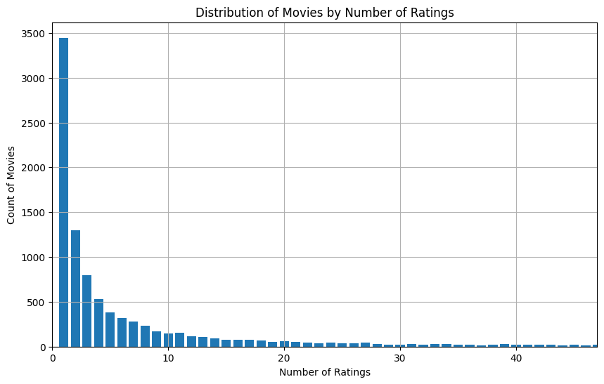

# Evaluation of Recommender Systems
As the models function, it is crucial to be concerned with how well the recommender systems work. Generally speaking, there are three main approaches for evaluation: user studies, online evaluation and offline evaluation. The first two involve real users. In particular, user studies recruit users to interact and perform specific tasks with recommender systems, while online evaluations use data from users by fully deploying applications in practice.  
As far as our project concerned, we won't explore too much about these first two types of evaluation. Our focus is primarily on offline evaluation, which is a type of evaluation that does not demand real users. In fact, offline methods are one of the most popular techniques used for testing recommender systems. Many standardized frameworks and measures have been developed for such approach. Most of this section will devote for offline evaluation and its various metrics for accuracy.  

## Accuracy of Ratings Prediction
The accuracy of a model in offline evaluation will be measured over a test set, which is separated from the train set. Let $\hat{R}$ be the set of predicted ratings that are also present in the test set. Denote the true rating of user $u$ for item $i$ by $r_ {ui}$ (which is in the test set), and the corresponding predicted rating from the model by $\hat{r}_ {ui}$. Then we know that the difference $r_ {ui} - \hat{r}_ {ui}$ represents error, or how much our prediction deviates from the true rating.  
Let us introduce the very famous metric for measuring recommender systems accuracy referred as **root mean squared error ($\text{RMSE}$)**. $\text{RMSE}$ is computed by taking the square root of **mean squared error ($\text{MSE}$)** whose value is derived by averaging square of errors over the predicted (test) set $\hat{R}$. Hence,  
$$\text{MSE} = \frac{1}{|\hat{R}|}\sum_ {\hat{r}_ {ui} \in \hat{R}}(r_ {ui} - \hat{r}_ {ui})^2$$  
So, by our previous conversation, the formula for $\text{RMSE}$ will be  
$$\text{RMSE} = \sqrt{\text{MSE}} = \sqrt{\frac{1}{|\hat{R}|}\sum_ {\hat{r}_ {ui} \in \hat{R}}(r_ {ui} - \hat{r}_ {ui})^2}$$  
$\text{RMSE}$ has units of ratings (if ratings are in stars unit, then so is $\text{RMSE}$) since $\text{MSE}$ is in square of rating units and $\text{RMSE}$ is the square root of $\text{MSE}$. $\text{RMSE}$ is used as standard metric for Netflix Prize contest.  
Because of squaring, $\text{RMSE}$ is sensitive to large errors and outliers, which is to say it disproportionately penalized large errors. For example, if we have model $A$ making four rating errors $4$, $0$, $0$, $0$, while model $B$ making four rating errors $2$, $2$, $2$, $0$, then $A$ will have $\text{RMSE} = 2.00$, but for $B$ it is $\text{RMSE} = 1.73$. In $B$, although the total error (which is $6$) is greater than that of $A$ (which is $4$), the spreading of errors across ratings reduces $\text{RMSE}$ of $B$ so that it is lesser than that of $A$.  
Another measure known as **mean absolute error ($\text{MAE}$)** does not exhibit this behavior of disproportionately penalizing large errors. As the name suggests, $\text{MAE}$ is evaluated by averaging the absolute value of errors over the test set,  
$$\text{MAE} = \frac{1}{|\hat{R}|}\sum_ {\hat{r}_ {ui}\in\hat{R}}|r_ {ui} - \hat{r}_ {ui}|$$  
Comeback to previous example of model $A$ and $B$, if applying formula of $\text{MAE}$, we see that model $A$ has $\text{MAE} = 1.00$ and model $B$ has $\text{MAE} = 1.50$. This result is followed from the fact that $\text{MAE}$ scales proportionately to the total error of model.  
Other verions of these two metrics are **normalized root mean squared error ($\text{NRMSE}$)** and **normalized mean absolute error ($\text{NMAE}$)**. These two are just $\text{RMSE}$ or $\text{MAE}$ divided by the value range of rating $r_ {\text{max}} - r_ {\text{min}}$ where $r_ {\text{max}}$ is the maximum rating ($5.0$ stars on movielens) and $r_ {\text{min}}$ is the minimum rating ($0.5$ stars on movielens). This is done so that $\text{NRMSE}$ and $\text{NMAE}$ both lie between $0$ and $1$. We won't use these measures much since they are simply scaled versions of $\text{RMSE}$ and $\text{MAE}$, the ranking of algorithms from these measures will be, of course, the same as from unnormalized ones.[^handbook]  
Now, we'll talk about the awkwardness when using $\text{RMSE}$ and $\text{MAE}$.  
  
The plot above is derived from a small movielens dataset named ml-latest-small, we have only shown 95% of movies for the reason of better visualization since other 5% have too many ratings which made the x-axis too long (up to 300 ratings instead of 50 as in the plot). From the plot, there are nearly 3,500 movies that only have one single rating. As the number of ratings increases, the count of movies drops significantly fast. This indicates that only a few movies are popular in terms of ratings. That is the perfect example of a phenomenon called the **long tail**. The long tail involves sparse high-rating movies, which means the majority of movies will be ignored (have low number of ratings), which makes up the long tail.  
Our test set is likely to be unbalanced as described. For metrics like $\text{RMSE}$ and $\text{MAE}$, which treat each rating equally, will be bias towards items that have large number of ratings. In order to counter this effect, one can compute $\text{RMSE}$ or $\text{MAE}$ specific only to each item, then get the average over all items. The same can be said for per-user average $\text{RMSE}$ or $\text{MAE}$.

## Evaluation of Ranking
$\text{RMSE}$ and $\text{MAE}$ are measures designed for evaluating overall error of models based on their actual rating values. In practice, only a few items are recommended to the users, say $\text{top-}n$ items. So, we are not only concerned with overall performance of models (measured by $\text{RMSE}$ or $\text{MAE}$), but also with how well the ordering of $\text{top-}n$ items, or ranking, satisfies users.  
Normally, the system can recommend a list of any number of items. Out of this list, some of the recommended items will be considered relevant to particular user. We'll wrap up the terminologies here. Recommended items that are relevant to users are called **true positives**, otherwise, if they are not relevant to users then they are called **false positives**. Irrelevant items that are not recommended are called **true negatives**, otherwise, if they are recommended then they are called **false negatives**. In context of movies recommendation, we consider a movie to be relevant to a user if the true rating of this user for said movie is greater than a certain threshold. Likewise, we consider that the system has recommended a movie to a user if the predicted rating is greater than the same threshold.     
The natural question is: what is the percentage of relevant items out of recommended list? Since it is percentage, it should depend on the total number of items in the list. If the list is too small, many relevant items will be missed. If the list is too large, many irrelevant items will be recommended. We can observe this dependency by the use of a **precision-recall** curve.  
Now let's define precision and recall metrics. Conceptually, the **precision at $k$**, denoted by $\text{Precision}@k$, is the fraction of recommended items that are also relevant to a particular user in the recommended $\text{top-}k$ list. In other words, $\text{Precision}@k$ is the fraction of recommended items that are true positives. For a given user and a given threshold $t$, let $S(k)$ be the set of recommended items in the $\text{top-}k$ list, that is the set of items in $\text{top-}k$ having predicted rating greater than $t$. Now, let $T$ be the set of items that the same user find relevant, that is the set of items having true rating greater than the same threshold $t$. As discussed, precision at $k$ is given by  
$$\text{Precision}@k = \frac{|S(k) \cap T|}{|S(k)|}$$  
By this definition, system's precision will be high if most of its recommendations are relevant to the user. For example, if there are $5$ recommended items on a $\text{top-}5$ list, and out of these $5$, only $4$ are relevant to user, then $\text{Precision}@5 = \frac{4}{5} = 0.8$. But precision doesn't account for all relevant items for a user, it only counts relevant items in the recommended list.  
**Recall at $k$**, denoted by $\text{Recall}@k$, accounts for all relevant items of a user. For a particular user, it calculates the fraction of relevant items that are actually get recommended by the model. So recall at $k$ is given by  
$$\text{Recall}@k = \frac{|S(k) \cap T|}{|T|}$$  
For the rare case where either $T$ or $S(k)$ is empty set, we adopt the convention that $\text{Precision}@k = \text{Recall}@k = 0$.[^surprise_faq_precision_recall] Per definition of recall, a high $\text{Recall}@k$ value may indicates that our model has captured most of the relevant items of a user by including them in $\text{top-}k$ list. If there are $16$ movies that a user find relevant, but only $12$ of them are recommended in a $\text{top-}20$ list, then $Recall@20 = \frac{12}{16} = 0.75$.  
In order for our system to work well, both $\text{Precision}@k$ and $\text{Recall}@k$ need to be maximized together. If our model has high precision but low recall, then although most of its recommendations are relevant, it still miss out a lot of other relevant items. If out model has low precision but high recall, then although it includes many relevant recommendations, it also recommends a bunch of irrelevant items. In taking account to both precision and recall, we combine two of them into a single measure, **$F_1$-score at $k$**, denoted by $F_1@k$. The $F_1$-score at $k$ is computed by taking harmonic mean of precision and recall,  
$$F_1@k = \frac{2}{\text{Precision}@k^{-1} + \text{Recall}@k^{-1}} = \frac{2 \cdot \text{Precision}@k \cdot \text{Recall}@k}{\text{Precision}@k + \text{Recall}@k}$$  
$F_1$-score is the balance view of precision and recall. If either $\text{Precision}@k$ or $\text{Recall}@k$ reaches zero, $F_1@k$ will diminish. If $F_1@k$ is high, it means that both $\text{Precision}@k$ and $\text{Recall}@k$ must be in good shape. If $F_1@k$ is low, both $\text{Precision}@k$ and $\text{Recall}@k$ probably are not that good. In this sense, $F_1$-score has avoided considering precision and recall in isolation.

[^handbook]: More detail at 8.3.2.1 from Recommender Systems Handbook.

[^surprise_faq_precision_recall]: Precision and recall definitions in this section are based on a discussion in [Surprise framework documentation's FAQ](https://surprise.readthedocs.io/en/stable/FAQ.html#how-to-compute-precision-k-and-recall-k).

[^argument_against_avoiding_rmse_literature]: Access [here](https://www.geosci-model-dev.net/7/1247/2014/gmd-7-1247-2014.pdf).